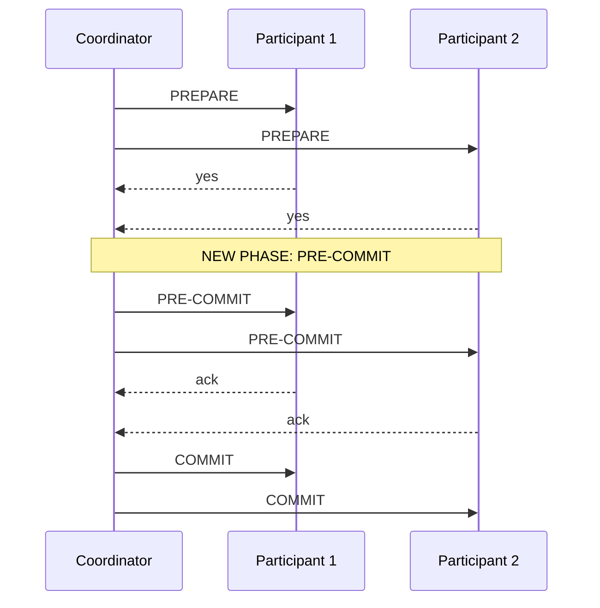

# Atomic Commit — Senior

<!-- level-focus -->
At senior level, focus on this question:

> What does Three-Phase Commit (3PC) add to try to fix 2PC's blocking
> problem, and why does it still fail under network partitions?

Prerequisite: [`middle.md`](middle.md).

---

## 3PC's addition: a "pre-commit" phase



3PC inserts a **pre-commit** phase between prepare and commit, with a key
property: once a participant receives pre-commit, it knows that **every**
participant voted yes (because pre-commit only gets sent if everyone
prepared successfully) — meaning a participant can now use a **timeout**
to safely proceed to commit **on its own**, without waiting indefinitely
for the coordinator, because it already has enough information to know the
outcome should be "commit."

## Why this still isn't sufficient under a network partition

```mermaid
flowchart LR
    subgraph Partition["Network partition scenario"]
        Group1["Group A: received\nPRE-COMMIT"] -.partitioned from.-> Group2["Group B: did NOT\nreceive PRE-COMMIT\n(prepared, but stuck at\nan earlier phase)"]
    end
    Group1 --> DecideCommit["Times out, safely\ncommits on its own"]
    Group2 --> DecideAbort["Times out, and since it\nnever got pre-commit,\nassumes ABORT is safe"]
    DecideCommit -.-.- DecideAbort
    Split["SPLIT DECISION:\nGroup A commits,\nGroup B aborts -\nATOMICITY VIOLATED"]
```

If a network partition occurs at exactly the wrong moment — some
participants have received pre-commit and can safely time out to "commit,"
while others (on the other side of the partition) never received it and
time out to "abort" instead — the two partitioned groups reach **different,
conflicting decisions independently**, each believing its choice is safe
given what it knows. This directly violates atomicity: the whole point of
the protocol. 3PC solves 2PC's blocking problem specifically **in the
absence of network partitions** (a crashed coordinator with a healthy
network can be recovered from), but a **partition** — not just a crash —
can still produce a genuine split-brain outcome, which is fundamentally
tied to the same impossibility result underlying the CAP theorem: you
cannot guarantee both availability (participants don't block forever) and
consistency (everyone reaches the same decision) when the network itself
can partition arbitrarily.

> 🎯 **Senior takeaway:** 3PC is a genuine, real improvement over 2PC for
> the specific failure mode of "coordinator crashes, network stays
> healthy" — but it does not, and provably cannot, fully solve the general
> distributed atomic commit problem under network partitions, because doing
> so would violate the same fundamental trade-off the CAP theorem
> describes. This is precisely why 3PC saw limited real-world adoption
> despite solving a real problem — it doesn't solve *enough* of the
> problem to justify its added complexity and latency over plain 2PC in
> most systems that end up needing partition tolerance anyway.

## Test yourself

1. Why does receiving "pre-commit" specifically give a participant enough
   information to safely time out and commit on its own, when receiving
   just "prepared" (in 2PC) does not?
2. Walk through, step by step, how a network partition can cause two
   groups of participants to reach opposite decisions under 3PC.
3. Why is this failure mode connected to the CAP theorem's fundamental
   trade-off, rather than being a fixable implementation bug in 3PC?

Continue to [`professional.md`](professional.md) to see how TCC differs
from both, and why sagas ultimately won out in industry practice.
