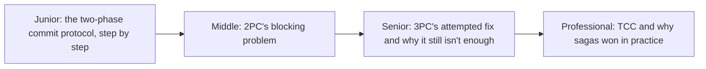
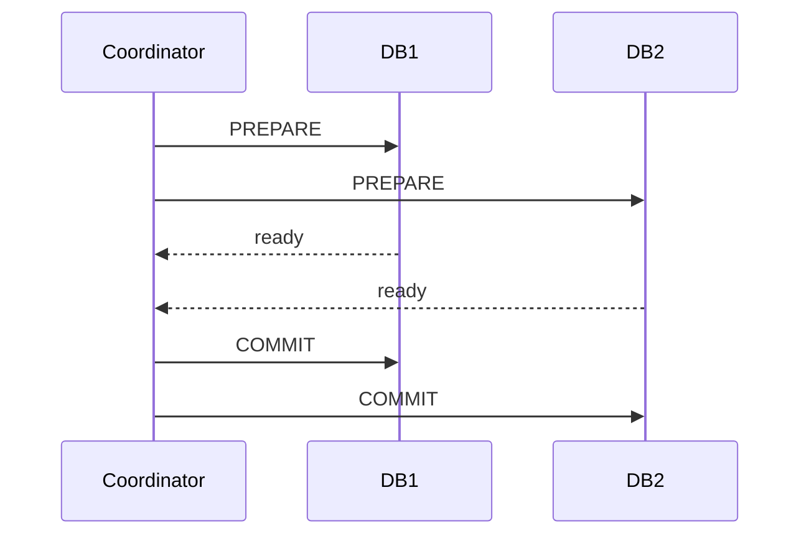

# Atomic Commit: 2PC, 3PC, and TCC

> Three progressively more sophisticated attempts to make "all these
> databases commit together, or none of them do" work across a network —
> and three sets of trade-offs that explain why sagas (not these protocols)
> dominate most modern distributed transaction design.

## Choose a level

| Level | Guide | You are done when |
|---|---|---|
| Junior | [Two-Phase Commit, step by step](junior.md) | You can trace 2PC's prepare and commit phases and explain what each guarantees. |
| Middle | [2PC's blocking problem](middle.md) | You can explain exactly what happens if the coordinator crashes after some participants prepare. |
| Senior | [3PC's attempted fix](senior.md) | You can explain what 3PC adds and why it still fails under network partitions. |
| Professional | [TCC and why sagas won](professional.md) | You can explain Try-Confirm-Cancel and articulate why the industry largely moved to sagas instead of any of these protocols. |

## Practice rule

Before reaching for 2PC/3PC/TCC for a new distributed transaction problem,
ask: "have I checked whether a saga (compensating transactions) can solve
this without requiring every participant to hold locks while waiting for a
coordinator?" In most modern systems, the answer determines whether you
need this whole topic at all.

## Related

- [2PC/3PC Coordinator](../../distributed-transaction/2pc-3pc-coordinator/README.md)
- [Saga: Orchestration vs Choreography](../../distributed-transaction/saga-orchestration-vs-choreography/README.md)
- [TCC (Try-Confirm-Cancel)](../../distributed-transaction/tcc-try-confirm-cancel/README.md)
