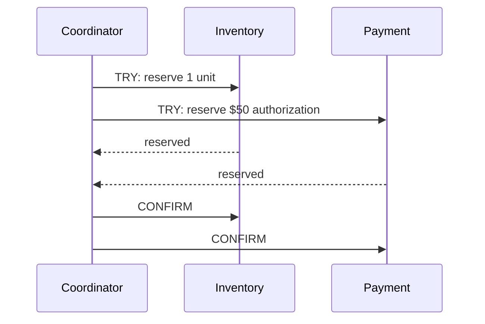
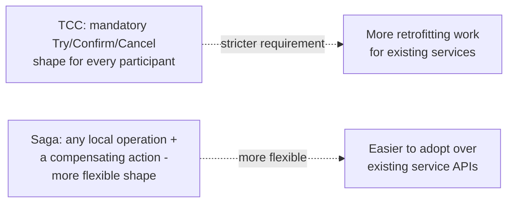

# Atomic Commit — Professional

<!-- level-focus -->
At professional level, focus on this question:

> How does Try-Confirm-Cancel (TCC) differ structurally from 2PC/3PC, and
> why did the industry largely move to sagas instead of any blocking
> atomic-commit protocol?

Prerequisite: [`senior.md`](senior.md).

---

## TCC: business-level compensations instead of low-level locks

TCC restructures the problem entirely: instead of the coordinator managing
low-level database locks across participants (2PC/3PC), each participant
exposes **three business-level operations**:

- **Try**: reserve resources without committing (e.g. "hold this inventory,
  don't decrement it yet" — a soft reservation, not a database row lock).
- **Confirm**: actually commit the reservation (decrement inventory for
  real), called once the coordinator knows every participant's Try
  succeeded.
- **Cancel**: release the reservation if any participant's Try failed.



The critical structural difference from 2PC: **Try doesn't require holding
a low-level database lock for the protocol's duration** — it's a
**business-level reservation** implemented however each participant's own
domain logic sees fit (a "reserved" status flag, a pending-authorization
hold on a credit card — the exact tool a payment processor already uses for
this). This means a stuck coordinator under TCC doesn't hold a database
lock hostage the way 2PC's blocked participants do (`middle.md`) — a
timed-out Try can simply be treated as failed and Cancelled, because
nothing beneath it is holding an exclusive lock waiting to be told what to
do.

## Why sagas, not TCC, became the dominant real-world pattern

TCC still requires every participant to implement three specific
operations and requires a central coordinator managing the overall
protocol — real production complexity that's non-trivial to retrofit onto
existing services. The **saga pattern** (see
[Saga: Orchestration vs Choreography](../../distributed-transaction/saga-orchestration-vs-choreography/README.md))
generalizes the same underlying idea (a sequence of local operations, each
compensatable) even further: it doesn't require a strict Try/Confirm/Cancel
three-phase shape at all — a saga step can simply be **"do the real thing
directly"** (no separate reservation phase) paired with a compensating
action to undo it if a later step fails, which is a **strictly less
restrictive** requirement on each participant's API design than TCC's
mandatory three-operation shape.



This flexibility — not needing to redesign every participant's API around
a specific three-phase contract — is the primary, documented reason sagas
became the dominant pattern for microservices-based distributed
transactions in industry practice (see the extensive real-world adoption
documented in Chris Richardson's *Microservices Patterns* and Caitie
McCaffrey's widely-cited saga talks), while 2PC/3PC/TCC remain more common
in narrower contexts: **within** a single database engine's own internal
distributed-transaction support (e.g. Postgres's `PREPARE TRANSACTION` for
XA-style two-phase commit across foreign data wrappers), or in specialized
financial/inventory systems where TCC's built-in reservation semantics
map naturally onto an existing "hold" concept the business already uses
(exactly like a payment authorization hold).

## Production checklist (staff-level)

1. **Default to sagas for new cross-service distributed transaction
   design**, reserving TCC specifically for domains where a natural
   "reservation/hold" concept already exists in the business logic (payment
   authorizations, inventory holds) and mapping cleanly onto Try/Confirm/
   Cancel is genuinely natural, not forced.
2. **Reserve 2PC/3PC for narrow, genuinely appropriate contexts**
   — typically within a single database engine's own built-in distributed
   transaction support across a small number of tightly-coupled resources,
   not across independently-deployed microservices.
3. **When evaluating TCC for a new system, count the actual number of
   participant APIs that would need a new three-operation redesign** — this
   concrete cost, not an abstract preference, should drive the TCC-vs-saga
   decision.
4. **Understand that no protocol in this family (2PC, 3PC, TCC) escapes
   the CAP-theorem-rooted trade-off from `senior.md`** — sagas don't
   "solve" this trade-off either; they sidestep the *blocking* aspect by
   avoiding held cross-participant locks entirely, accepting eventual
   consistency and a window of partial completion instead.
5. **In an architecture review proposing 2PC/3PC/TCC for a new
   cross-service feature, require an explicit justification for why a saga
   wouldn't work** — given the industry's clear, documented preference for
   sagas at the microservices level, this should be the default question,
   not an afterthought.

## Cheat Sheet

```text
+------------------------------------------------------------------+
|            ATOMIC COMMIT — 2PC/3PC/TCC — INTERNALS & SCALE           |
+------------------------------------------------------------------+
| 2PC: Prepare (vote) -> Commit. BLOCKS if coordinator crashes after     |
| everyone prepares - locks held indefinitely until recovery             |
| 3PC: adds PRE-COMMIT phase - solves blocking for coordinator crash     |
| WITHOUT a partition, but a genuine network PARTITION can still split   |
| participants into groups that reach OPPOSITE decisions (CAP-rooted,    |
| not a fixable bug)                                                     |
+------------------------------------------------------------------+
| TCC: Try (soft business-level reservation, NOT a DB lock) / Confirm /  |
| Cancel. Doesn't hold a low-level lock hostage on coordinator failure -  |
| a timed-out Try can just be Cancelled                                 |
+------------------------------------------------------------------+
| Sagas won in industry practice: MORE FLEXIBLE than TCC's mandatory     |
| 3-operation shape - a saga step can be "just do it directly" + a       |
| compensation, no forced reservation phase. Lower retrofit cost onto    |
| existing service APIs is the primary documented reason for adoption   |
+------------------------------------------------------------------+
| 2PC/3PC/TCC remain appropriate: within ONE database engine's own       |
| built-in distributed transaction support, or domains with a NATURAL   |
| reservation concept (payment holds, inventory holds) mapping onto TCC  |
+------------------------------------------------------------------+
```

## Test yourself

1. Why doesn't a timed-out TCC "Try" leave a low-level database lock
   hostage the way a timed-out 2PC "prepared" participant does?
2. Why is a saga's flexibility (no mandatory three-operation shape)
   specifically what made it easier to adopt across existing
   microservices, compared to TCC?
3. In an architecture review, a team proposes 3PC for a new cross-service
   checkout flow spanning 5 independently-deployed services. What would you
   ask them to justify, based on this page's reasoning?

## Further Reading

- Skeen — "Nonblocking Commit Protocols" (1981 — the original 3PC paper).
- Pat Helland — "Life beyond Distributed Transactions: an Apostate's
  Opinion" (the influential, widely-cited argument against 2PC-style
  protocols for large-scale systems, foreshadowing the industry's move to
  sagas).
- Chris Richardson — *Microservices Patterns* (Saga and TCC chapters, with
  the documented industry-adoption reasoning).
- See also: [Saga: Orchestration vs Choreography — senior/professional](../../distributed-transaction/saga-orchestration-vs-choreography/README.md),
  [CAP Theorem](../../02-tradeoffs-framework/cap-theorem/README.md).
