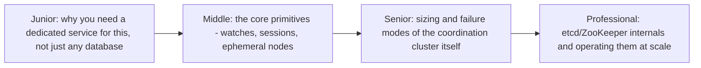
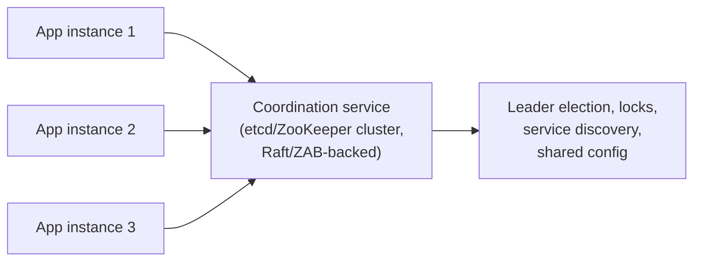

# Coordination Services

> A small, purpose-built, highly-consistent cluster (etcd, ZooKeeper,
> Consul) that the rest of your distributed system leans on for the things
> ordinary databases aren't built for: leader election, distributed locks,
> service discovery, and configuration that must never be read
> inconsistently.

## Choose a level

| Level | Guide | You are done when |
|---|---|---|
| Junior | [Why a dedicated service](junior.md) | You can explain why an ordinary database (even a strongly consistent one) is usually the wrong tool for this job. |
| Middle | [Watches, sessions, ephemeral nodes](middle.md) | You can explain how these three primitives combine to implement leader election or service discovery. |
| Senior | [Sizing and failure modes](senior.md) | You can explain why the coordination cluster itself becomes a single point of failure if under-provisioned. |
| Professional | [etcd/ZooKeeper internals at scale](professional.md) | You can explain the consensus protocol underneath and real operational limits (watch storms, request rate ceilings). |

## Practice rule

Before reaching for a coordination service, ask: "do I actually need
linearizable, strongly-consistent reads and writes for this, or would
eventual consistency (a regular cache, a regular database) be fine?" A
coordination service is deliberately low-throughput and expensive per
operation, in exchange for consistency guarantees most application data
doesn't need.

## Related

- [Leader Election](../leader-election/README.md)
- [Gossip Protocol](../gossip-protocol/README.md)
- [Leases & Fencing](../leases-and-fencing/README.md)
