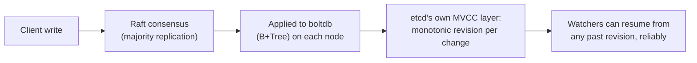
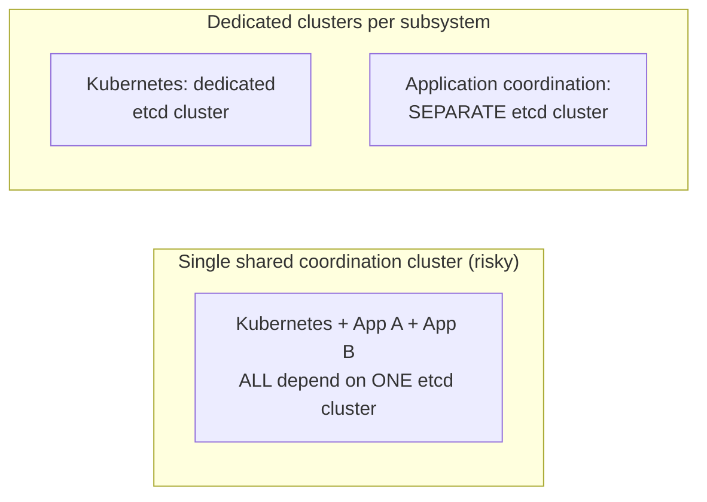

# Coordination Services — Professional

<!-- level-focus -->
At professional level, focus on this question:

> What are etcd's and ZooKeeper's actual internal storage/consensus
> mechanisms, and what real operational limits and mitigation patterns do
> production deployments rely on at scale?

Prerequisite: [`senior.md`](senior.md).

---

## etcd internals: Raft plus a boltdb (B+Tree) backend, with MVCC

etcd runs Raft (see the Raft professional page) for consensus and stores
its actual key-value data in **boltdb**, an embedded B+Tree-based key-value
store (see the B+Tree professional page) — every write goes through Raft
consensus first (replicated to a majority), then gets applied to boltdb on
each node independently. etcd additionally implements its own **MVCC**
layer on top of boltdb (conceptually similar to the MVCC professional page,
but implemented at the application layer rather than relying on boltdb's
own semantics) specifically to support etcd's **revision-based watch and
history API** — every key change gets a new, monotonically increasing
global revision number, letting clients "watch from revision N" and
reliably catch up on everything that happened since, even across a
disconnect.



## ZooKeeper internals: ZAB (a Paxos-family protocol) and in-memory + snapshotted storage

ZooKeeper predates etcd and uses **ZAB (ZooKeeper Atomic Broadcast)**, a
protocol with strong conceptual similarity to Raft's leader-based
replication but developed independently and specialized for ZooKeeper's
specific "totally ordered broadcast" requirement. ZooKeeper keeps its
entire dataset **in memory** on every node (for read speed) while
periodically snapshotting to disk plus maintaining a write-ahead
transaction log (the same durable-log-plus-snapshot pattern from the Raft
professional page's snapshotting section) — meaning ZooKeeper's practical
dataset size ceiling is bounded by available RAM across the ensemble, a
real, documented operational constraint that etcd (disk-backed via boltdb)
doesn't share in the same way.

## Real production mitigations for `senior.md`'s failure modes

- **Client-side jittered reconnection backoff**: mitigating the mass-
  reconnection thundering herd from `senior.md` requires **client library
  configuration**, not just server-side capacity — etcd and ZooKeeper
  client libraries both support configurable reconnect backoff/jitter
  specifically because this is a well-known operational pattern to guard
  against, echoing the same full-jitter principle from the Retries &
  Idempotency professional page, applied to coordination-service
  reconnection specifically.
- **Watching prefixes/directories instead of many individual keys**:
  reduces the number of distinct watch registrations (and therefore
  notification fan-out overhead) by letting one watch cover an entire
  namespace of related keys, mitigating the watch-storm pattern from
  `senior.md`.
- **Dedicated coordination clusters per major subsystem, rather than one
  shared cluster for an entire organization**: large-scale operators
  (documented in various companies' engineering blogs) run **separate**
  etcd/ZooKeeper clusters for genuinely independent subsystems (e.g. one for
  Kubernetes cluster state, a separate one for application-level service
  discovery) specifically so that a load spike or incident in one
  subsystem's coordination usage can't degrade an unrelated subsystem's
  coordination needs — the same blast-radius-containment principle from the
  Database Federation professional page, applied to coordination
  infrastructure itself.



## Production checklist (staff-level)

1. **Configure client-side reconnect backoff with jitter explicitly** for
   any service using a coordination service at meaningful scale — this is
   the direct, actionable mitigation for `senior.md`'s mass-reconnection
   thundering herd, and it's a client-library setting, not just a server
   capacity question.
2. **Prefer watching prefixes over many individual keys** wherever your
   access pattern allows it, to reduce watch-registration count and
   notification fan-out overhead.
3. **Run dedicated coordination clusters per major, independent subsystem**
   rather than one organization-wide shared cluster, once your scale
   justifies the added operational overhead — this contains blast radius
   exactly as federation does for application databases.
4. **Know your coordination service's dataset-size constraint** (ZooKeeper:
   bounded by ensemble RAM; etcd: bounded by boltdb/disk, but etcd itself
   documents a recommended maximum database size) and monitor against it
   explicitly — this is a real, hard operational ceiling, not a soft
   guideline.
5. **In a capacity-planning review for a new coordination-service-dependent
   system, explicitly model the mass-restart/reconnection burst scenario**
   (not just steady-state load) against the coordination cluster's actual
   consensus-bound throughput ceiling — this is the single most common gap
   in coordination-service capacity planning.

## Cheat Sheet

```text
+------------------------------------------------------------------+
|            COORDINATION SERVICES — INTERNALS & SCALE                 |
+------------------------------------------------------------------+
| etcd: Raft consensus + boltdb (B+Tree) storage + etcd's OWN MVCC       |
| layer with a monotonic global revision per change -> watches can       |
| reliably resume "from revision N" even across a disconnect             |
+------------------------------------------------------------------+
| ZooKeeper: ZAB (Paxos-family protocol) + IN-MEMORY dataset on every    |
| node (snapshotted + WAL to disk) -> dataset size is bounded by         |
| ensemble RAM, a real operational ceiling etcd doesn't share the        |
| same way                                                               |
+------------------------------------------------------------------+
| Real mitigations for senior.md's failure modes:                       |
|   client-side JITTERED RECONNECT BACKOFF (config, not server capacity)|
|   watch PREFIXES not many individual keys (reduces fan-out)            |
|   DEDICATED clusters per major subsystem (blast-radius containment,    |
|     same principle as database federation)                            |
+------------------------------------------------------------------+
```

## Test yourself

1. Why does etcd's own MVCC/revision layer (on top of boltdb) matter
   specifically for making watches reliable across a client disconnect,
   rather than just for storage correctness?
2. Why is ZooKeeper's in-memory dataset model a real operational
   constraint that a team must actively monitor, rather than an
   implementation detail?
3. Design the client-side reconnection configuration (backoff base, max,
   jitter) for a fleet of 2,000 application instances that all restart
   together during a rolling deploy, connecting to a shared etcd cluster.

## Further Reading

- etcd documentation — "Understand etcd's storage" (boltdb + MVCC
  internals) and "Watch storms" mitigation guidance.
- Apache ZooKeeper documentation — "ZooKeeper Internals" (ZAB protocol,
  in-memory data model).
- Junqueira, Reed, Serafini — "Zab: High-performance broadcast for
  primary-backup systems" (the original ZAB paper).
- See also: [Raft — professional](../../consensus/raft/professional.md),
  [Database Federation — professional](../../../databases/scaling/database-federation/professional.md).
