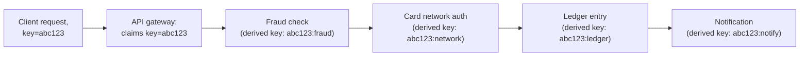
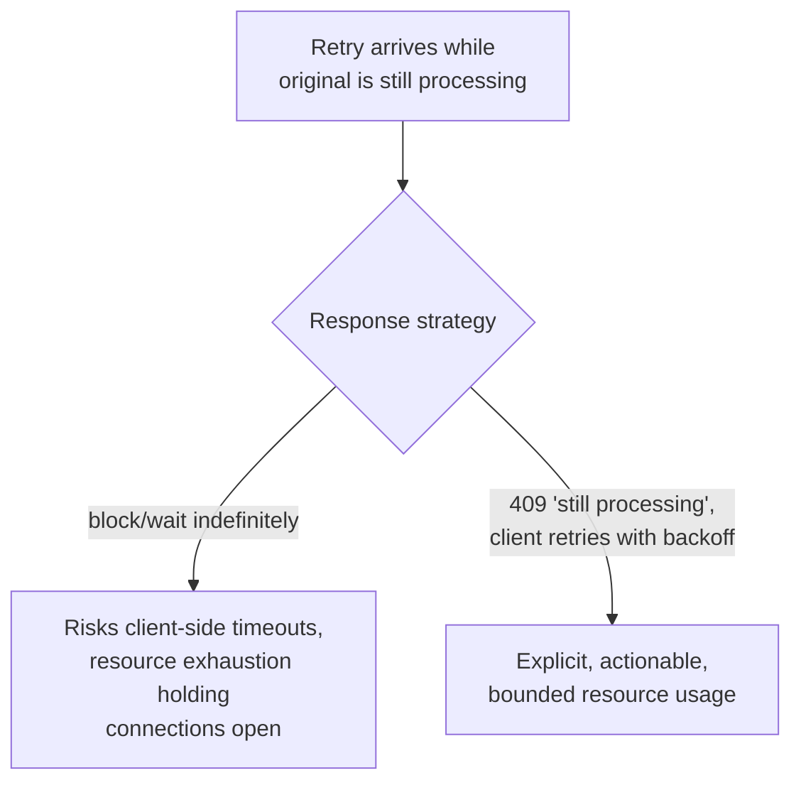

# Idempotency Keys — Professional

<!-- level-focus -->
At professional level, focus on this question:

> How does a production payment API (Stripe's documented model) actually
> implement idempotency across a distributed system with multiple servers
> and downstream calls, not just one database table?

Prerequisite: [`senior.md`](senior.md).

---

## Idempotency across a multi-step, multi-service operation

`senior.md`'s pattern solves idempotency for a **single** atomic
database operation. A real payment charge typically involves **multiple**
downstream calls (fraud check, card network authorization, ledger entry,
notification) — each with its own side effect, and each potentially
failing independently partway through. Stripe's documented architecture
addresses this by making the **entire multi-step operation** idempotent as
a unit: the idempotency key locks in the request at the API gateway layer
**before** any downstream call begins, and every downstream call within
that logical operation is itself keyed off a **derived** idempotency key
(e.g. `{original_key}:fraud_check`, `{original_key}:card_network`) so that
a partial retry (the overall operation retried after step 2 of 4 already
succeeded) correctly skips the already-completed downstream steps
individually, not just the operation as a whole.



This is, structurally, the same pattern as a Saga (see
[Saga: Orchestration vs Choreography](../../distributed-transaction/saga-orchestration-vs-choreography/README.md))
combined with per-step idempotency — each step's own idempotency key makes
that specific step safely re-runnable independently, which is what lets
the overall multi-step operation resume correctly from wherever it actually
left off, rather than needing to be entirely all-or-nothing.

## Locking scope: per-key, not global

At high request volume, `senior.md`'s unique-constraint-based claiming
must scale to potentially millions of concurrent distinct keys — this
works cleanly because the "lock" is scoped to **each individual key**
(a unique constraint on one row), not a global lock across all requests.
Production systems at Stripe's scale shard the idempotency-key table (or
use a distributed key-value store like DynamoDB with the key as the
partition key) specifically so that claiming key A and claiming key B are
**completely independent operations**, hitting different physical
partitions — this is a direct application of the partition-key design
principles from the NoSQL Modeling professional page, applied specifically
to an idempotency-key store.

## Handling the "still processing" window explicitly

A retry arriving **while** the original request is still being processed
(not yet failed, not yet succeeded) is a real, common case at scale
(a slow downstream call, not just a lost response) — Stripe's documented
API behavior returns a specific error (`409 Conflict` / a distinct
"request in progress" status) for this case, rather than making the
retrying client wait indefinitely or silently reprocess. This gives the
calling client explicit, actionable information (retry again shortly)
instead of an ambiguous hang or an incorrect duplicate processing attempt.



## Production checklist (staff-level)

1. **Design idempotency as an end-to-end property of the whole multi-step
   operation**, using derived per-step keys, not just a single top-level
   check — a partial failure deep in a multi-step process needs step-level
   idempotency to resume correctly.
2. **Shard/partition the idempotency-key store by the key itself**, so
   claiming different keys never contends on the same physical resource —
   treat this as a partition-key design decision with the same rigor as any
   other high-volume keyed store.
3. **Return an explicit "still processing" status (not a silent
   duplicate-processing attempt or an indefinite hang) for retries arriving
   during an in-flight original request** — give the client actionable
   information rather than ambiguity.
4. **Validate request-body hash matching (`middle.md`) as a hard
   requirement**, especially in a multi-team organization where different
   services might reuse an idempotency key incorrectly — treat a mismatch
   as a loud, logged conflict, not a silent pass-through.
5. **In a design review for any new payment/critical-side-effect API,
   require an explicit idempotency-key design doc** covering: key
   generation ownership (client or server?), retention window, per-step
   derivation for multi-step operations, and the in-flight-request response
   behavior — treat this as core API contract design, not an
   implementation afterthought.

## Cheat Sheet

```text
+------------------------------------------------------------------+
|              IDEMPOTENCY KEYS — INTERNALS & SCALE                   |
+------------------------------------------------------------------+
| Single-step idempotency: unique-constraint-based atomic claim          |
| (INSERT...ON CONFLICT) closes the concurrent-duplicate race            |
| Multi-step operations need DERIVED per-step keys                       |
| (key:fraud_check, key:card_network, ...) so a partial retry resumes    |
| correctly from whichever step actually failed, not from scratch        |
+------------------------------------------------------------------+
| Scale: shard/partition the idempotency-key store BY THE KEY itself     |
| (unique-constraint claims on different keys are independent -          |
| this is a partition-key design decision, same rigor as any             |
| high-volume keyed store)                                               |
+------------------------------------------------------------------+
| In-flight retry (original still processing): return an EXPLICIT        |
| "still processing" status (409-style), not a silent reprocess or       |
| an indefinite block - gives the client actionable, bounded behavior    |
+------------------------------------------------------------------+
```

## Test yourself

1. Why does a multi-step payment operation need per-step derived
   idempotency keys, rather than just one top-level key for the whole
   operation?
2. Why does sharding the idempotency-key store by the key itself allow
   claiming millions of distinct keys concurrently without contention,
   while a single global lock would not?
3. Design the response your API should return to a retry arriving 200ms
   into a request that typically takes 2 seconds to fully process, and
   explain why that's better than either blocking or reprocessing.

## Further Reading

- Stripe API documentation — "Idempotent Requests" (the production model
  referenced throughout this page).
- See also: [Saga: Orchestration vs Choreography](../../distributed-transaction/saga-orchestration-vs-choreography/README.md),
  [NoSQL Modeling — professional](../../../databases/data-modeling/nosql-modeling/professional.md).
