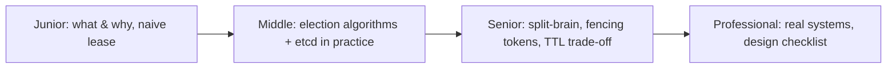
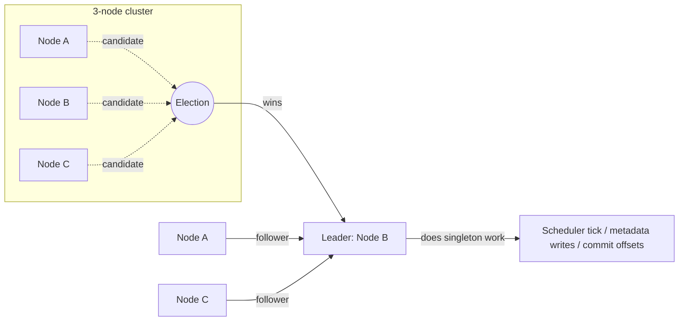

# Leader Election

> Make exactly one node in a cluster do the singleton job — and never let two
> nodes believe they're in charge at the same time. This is the concept behind
> the Kafka controller, the Flink JobManager, the Airflow HA scheduler lock,
> and every "exactly one worker runs the cron" system you've used.

## Choose a level

| Level | Guide | You are done when |
|---|---|---|
| Junior | [What problem does this solve?](junior.md) | You can explain why a job needs election instead of a fixed assignment, and why a plain lease can create split-brain. |
| Middle | [Election algorithms in practice](middle.md) | You can name which algorithm (bully/ring/lease/Raft) a given system uses, and wire up an etcd-based election yourself. |
| Senior | [Make it safe under failure](senior.md) | You can design a fencing token and defend a TTL choice against a stated availability SLO. |
| Professional | [How real systems do it](professional.md) | You can compare Kafka KRaft, Flink HA, Airflow, and Delta Lake's approaches, and choose the right one for a new pipeline. |

## Practice rule

Before reading the fix, try to break the naive lease-based design yourself:
freeze a "leader" process past its lease TTL, let a new leader be elected, then
unfreeze the old one. If you can't explain why the old leader's next write is
dangerous, start at `junior.md`.

## Related

- [CAP Theorem](../../02-tradeoffs-framework/01-cap-theorem/README.md)
- [Consistency Models](../../02-tradeoffs-framework/04-consistency-models/README.md)
- [2PC/3PC Coordinator](../../distributed-transaction/06-2pc-3pc-coordinator/README.md)
