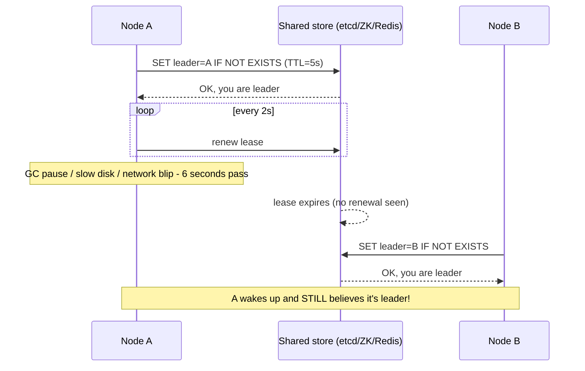

# Leader Election — Junior

<!-- level-focus -->
At junior level, focus on this question:

> What problem does leader election solve, and why does the obvious fix (a
> lease with a timeout) quietly break?

---

## What problem does this solve?

Most work in a distributed data platform is **sharded** — 10 Kafka partitions,
10 workers, each worker owns some partitions, no coordination needed. But a
few jobs must run on **exactly one node**, ever:

- The **Kafka controller** — one broker decides partition leadership for the
  whole cluster.
- The **Airflow scheduler** in HA mode — multiple scheduler processes run, but
  critical sections (like assigning a task) must not be double-executed.
- A **Debezium/CDC connector** reading a single database's write-ahead log —
  two readers would duplicate or corrupt the change stream.
- A **compaction job** over the same set of Parquet files — two compactors
  racing would corrupt the table.

Run two of these "leaders" at once and you get duplicated writes, corrupted
compaction, or two brokers disagreeing about who owns a partition. **Leader
election** is the mechanism that picks exactly one node to do this work, and
re-picks a new one if the current leader dies.

> 🎓 **Takeaway:** if a job must run on exactly one node, you need election,
> not a manual "assign it to server-1" — because server-1 will eventually
> crash, deploy, or get network-partitioned, and something needs to take over
> automatically.

## The naive approach

The simplest idea: pick a lock with a timeout ("lease"). Whoever holds the key
`/leader` in a shared store (etcd, ZooKeeper, Redis, a DB row) is the leader.
The lock expires after `TTL` seconds unless renewed.

## Why it breaks

This is the trap: a lease is a **timer-based belief**, and timers lie. A
garbage-collection pause, a slow disk write, or a brief network partition can
make node A *believe* it still holds leadership for seconds after the cluster
has already elected node B. For that window, **two nodes both think they're
the leader and both act** — this is called **split-brain**, and it is the
single most expensive class of bug in this space (duplicate CDC events,
double-committed offsets, corrupted compaction output).

The fix (fencing tokens) is a `senior.md` topic. First, `middle.md` covers
*how* an election actually picks a winner in the first place.

## Test yourself

1. In the sequence diagram above, at what exact moment did node A's belief
   diverge from reality?
2. Why doesn't restarting node A's process immediately fix the danger — what
   else has to happen first?
3. Name a real data pipeline job (not in the list above) that must run on
   exactly one node, and explain what breaks if it runs on two.

Continue to [`middle.md`](middle.md).
