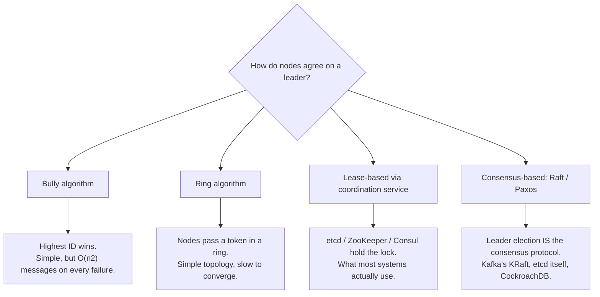

# Leader Election — Middle

<!-- level-focus -->
At middle level, focus on this question:

> What are the actual algorithms used to elect a leader, and how do you wire
> one up yourself?

Prerequisite: [`junior.md`](junior.md).

---

## Election algorithms

There are three broad families. A data engineer will meet all three, usually
hidden inside a framework rather than hand-rolled.



| Algorithm | Idea | Where you'll see it in data engineering |
|---|---|---|
| **Bully** | Every node knows every other node's ID; the highest ID that's alive declares itself leader; announces to all. | Rarely used directly, but the mental model behind "highest broker ID becomes controller" in old Kafka (pre-KRaft) via ZooKeeper ephemeral sequence nodes. |
| **Ring** | Nodes arranged logically in a ring; an election message circulates, each node compares IDs, highest survives the lap. | Chubby-style systems, older cluster managers. Rare in modern data stacks. |
| **Lease-based** | A shared, strongly-consistent store (etcd/ZooKeeper/Consul) holds a key with a TTL; whoever holds it is leader. | Airflow scheduler lock, Kafka Connect leader election (via the group protocol), most homegrown "singleton job" systems. |
| **Consensus-based (Raft/Paxos)** | The leader **is** whichever node wins a quorum vote for the current term; leadership and log replication are the same protocol. | Kafka's KRaft controller, etcd's own leader, CockroachDB/TiDB range leaders. |

> **Data-engineering framing:** you almost never implement Bully or Ring
> yourself. You either (a) lease a key in etcd/ZooKeeper/Consul, or (b) rely on
> a system that already runs Raft internally (Kafka KRaft, etcd) and expose a
> "who is the leader right now" API.

## Lease-based election in practice

Using etcd (the most common choice for homegrown coordinators):

```python
import etcd3

client = etcd3.client()
election = client.election("/pipeline/scheduler-leader")

# Blocks until this node wins the campaign (or another node already holds it
# and later releases/expires it).
election.campaign(b"node-A")
try:
    run_singleton_scheduler_loop()
finally:
    election.resign()
```

Under the hood: `campaign()` creates a lease with a TTL, attaches a key to it,
and etcd's own Raft-replicated log guarantees only one client can hold that
key at a time — etcd itself uses consensus so the "who holds it" question
never has two different answers on different etcd nodes. The client library
sends periodic **keepalives** to renew the lease; if keepalives stop (process
frozen, network cut), the lease expires and etcd lets the next campaigner win.

This is strictly better than hand-rolled Redis `SET NX PX`, because:
- Redis alone has no consensus underneath it — a single Redis node is a single
  point of truth with no built-in split-brain protection (the "Redlock" debate
  exists precisely because of this).
- etcd/ZooKeeper/Consul are themselves built on Raft/ZAB, so "who holds the
  lease" is a question with one, cluster-wide-agreed answer.

## Test yourself

1. Why is Redis alone a weaker foundation for election than etcd/ZooKeeper?
2. Name one real data system for each of the four algorithm families in the
   table (you may say "not used in practice" for Bully/Ring — that's valid).
3. In the etcd example, what happens to a second node that calls `campaign()`
   while node A still holds the lease?
4. What does the client library have to do continuously for node A to *stay*
   leader, and what happens the instant it stops?

Continue to [`senior.md`](senior.md) to see why the lease above is still not
safe enough on its own.
