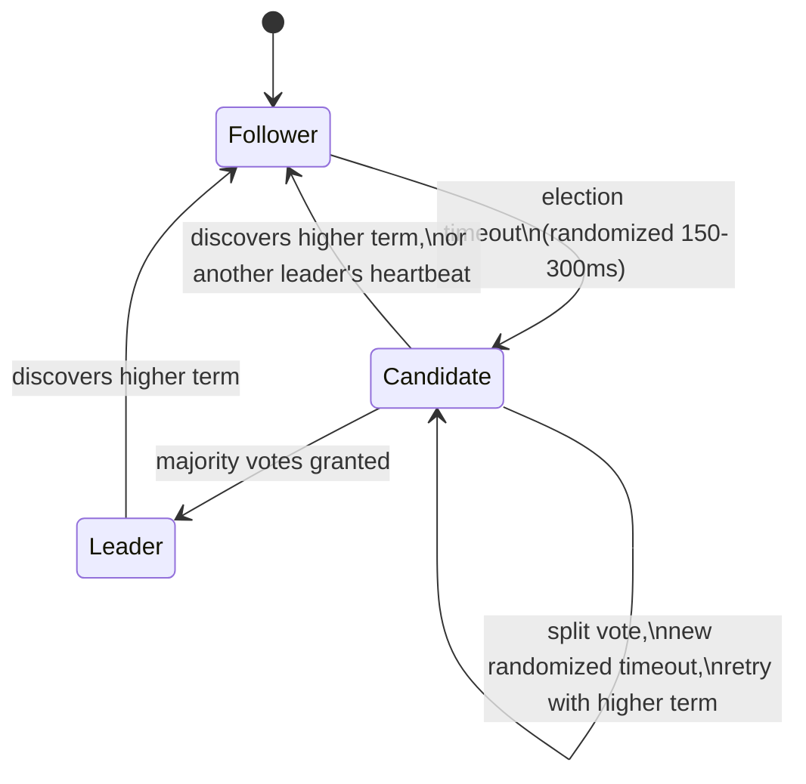
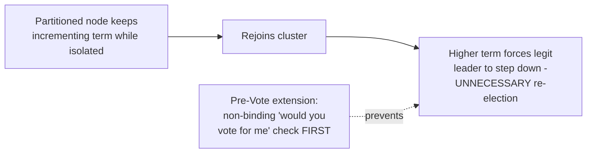

# Leader Election — Professional

<!-- level-focus -->
At professional level, focus on this question:

> How does Raft's leader election algorithm actually work at the message
> level, and what real production incidents (etcd, Kafka KRaft) teach about
> the gap between the algorithm's proof and its operational reality?

Prerequisite: [`senior.md`](senior.md).

---

## Raft leader election, at the message level

Raft (Ongaro & Ousterhout, 2014 — explicitly designed to be more
understandable than Paxos while providing equivalent guarantees) elects a
leader through a precise state machine: every node is a **Follower**,
**Candidate**, or **Leader**. A Follower that receives no
`AppendEntries` heartbeat within its randomized **election timeout**
(typically 150-300ms, randomized per node specifically to reduce the chance
of two nodes timing out simultaneously and splitting the vote) transitions
to Candidate, increments its **term** number, votes for itself, and sends
`RequestVote` RPCs to every peer. A peer grants its vote only if the
candidate's log is **at least as up-to-date** as its own (comparing last
log entry's term, then index) — this specific rule is what guarantees a
new leader always has every previously-committed entry, without needing a
separate log-reconciliation phase after election.



A candidate becomes leader only upon receiving votes from a **strict
majority** of the cluster (not just a plurality) — this majority
requirement is the actual mechanism preventing two simultaneous leaders in
the same term: two candidates in the same term cannot both receive a
majority of votes, because their majorities would have to overlap in at
least one node, and that node can only vote once per term.

## The real production gap: what Raft's proof does and doesn't cover

Raft's safety proof guarantees no two leaders exist **for the same term**.
It says nothing about **operational timing pathologies** that production
systems must separately engineer around:

- **Pre-vote extension**: without it, a node that's partitioned away from
  the cluster (but still running) keeps incrementing its term and calling
  elections it can never win, then — upon rejoining — its higher term number
  forces the legitimate leader to step down even though nothing was actually
  wrong with it, causing an **unnecessary, disruptive re-election**. The
  **Pre-Vote** extension (implemented in etcd's Raft library and
  CockroachDB) adds a non-binding "would you vote for me" round *before*
  incrementing the term, so a partitioned node's term never inflates in the
  first place unless it could plausibly win a real election.
- **Leader stickiness / leadership transfer**: a naive implementation
  re-elects fully randomly on every leader change; production Raft libraries
  implement an explicit `TransferLeadership` RPC so a planned leader
  restart/deploy hands off cleanly to a specific successor with minimal
  unavailability, rather than relying on the timeout-driven election path
  (which necessarily includes the full randomized-timeout delay) even for
  fully planned, non-failure leadership changes.



## Real production incident patterns

- **etcd's own documented incident history** includes cases where disk
  I/O latency spikes on the leader (a slow `fsync` for the Raft log entry,
  since Raft requires the log entry durably persisted before acknowledging
  it) caused the leader to miss its own heartbeat deadline to followers,
  triggering an election **not from network partition but from storage
  latency masquerading as leader failure** — a direct, documented
  illustration that "leader election" failure diagnosis must include
  storage/disk latency instrumentation on the current leader, not just
  network-layer monitoring.
- **Kafka's KRaft migration** (KIP-500) specifically cites reducing
  operational complexity of running a *separate* ZooKeeper ensemble
  alongside the Kafka cluster as a primary motivation — but KRaft's own
  controller quorum still has its own analogous election-timeout tuning,
  disk-latency sensitivity, and quorum-sizing trade-offs; migrating off
  ZooKeeper eliminates one coordination system's operational surface, not
  the fundamental leader-election operability considerations themselves.

## Production checklist (staff-level)

1. **Use a Raft library with Pre-Vote support (etcd's `raft` package,
   CockroachDB's implementation)** for any new leader-election system built
   on Raft — the disruptive-partition-rejoin failure mode is well-documented
   and solved; don't reimplement vanilla Raft without it.
2. **Instrument disk write/fsync latency on the current leader as a
   leader-election-relevant metric**, not just network health — a slow disk
   can trigger elections that look identical to network partitions in
   election-rate dashboards without this specific instrumentation.
3. **Use explicit leadership-transfer APIs for planned maintenance/deploys**
   rather than relying on timeout-driven re-election — this materially
   reduces unavailability windows during routine operations, and is a
   standard, available feature in production-grade Raft implementations.
4. **Tune election timeout jointly with your actual network RTT and disk
   fsync latency distributions**, not a default value — too aggressive a
   timeout relative to your infrastructure's real tail latencies causes
   spurious elections under normal jitter; too conservative delays genuine
   failure detection.
5. **In a postmortem for an unexpected leader election, check leader-side
   disk/fsync latency and network partition indicators as two separate,
   equally-likely root causes** before concluding "network issue" by
   default — the etcd incident pattern above shows storage latency is a
   real, recurring, and easily overlooked cause.

## Cheat Sheet

```text
+------------------------------------------------------------------+
|              LEADER ELECTION — INTERNALS & SCALE                    |
+------------------------------------------------------------------+
| Raft: randomized election timeout -> Candidate increments TERM,       |
| requests votes. Vote granted only if candidate's log is AT LEAST AS   |
| UP-TO-DATE (term then index) - guarantees new leader has every         |
| committed entry with no separate reconciliation phase                 |
| STRICT MAJORITY required to become leader -> two majorities in the     |
| same term must overlap in >=1 node -> no two leaders per term          |
+------------------------------------------------------------------+
| Raft's PROOF covers same-term safety. It does NOT cover:                |
|   disruptive re-elections from a partitioned node's inflated term       |
|     -> fixed by PRE-VOTE extension (non-binding check before          |
|        incrementing term)                                              |
|   unavailability during PLANNED leader changes -> fixed by explicit    |
|     TransferLeadership RPC, not timeout-driven election                |
+------------------------------------------------------------------+
| Real incidents: leader-side DISK/FSYNC LATENCY can trigger an          |
| election that looks like a network partition (etcd's documented        |
| history) - instrument storage latency on the leader specifically       |
+------------------------------------------------------------------+
```

## Test yourself

1. Explain precisely why Raft's "log at least as up-to-date" voting rule
   guarantees a newly elected leader already has every previously
   committed log entry, without a separate catch-up phase.
2. Why does a strict-majority requirement (not just "most votes") prevent
   two leaders from being elected in the same term, even with an even
   number of nodes experiencing a network partition?
3. An etcd cluster reports a leader election with no observed network
   partition. What metric would you check first, based on documented
   real-world incident patterns, and why?

## Further Reading

- Ongaro & Ousterhout — "In Search of an Understandable Consensus Algorithm"
  (the original Raft paper, 2014 — read the leader election section and the
  membership-change/Pre-Vote follow-on discussion).
- etcd `raft` library documentation and design docs — Pre-Vote and
  leadership-transfer implementation details.
- KIP-500 (Apache Kafka) — "Replace ZooKeeper with a Self-Managed Metadata
  Quorum" (KRaft's design rationale and operational trade-offs).
- See also: [senior.md](senior.md) (fencing tokens, reused in the Cache
  Stampede professional page's distributed-lease design).
