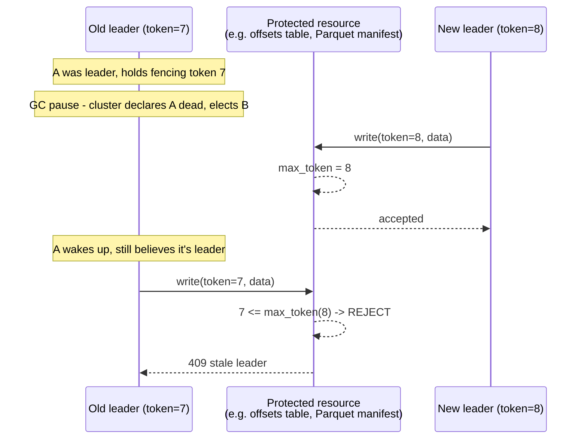

# Leader Election — Senior

<!-- level-focus -->
At senior level, focus on this question:

> How do you make leader election **safe** under real-world failure — GC
> pauses, network partitions, clock skew — not just "usually correct"?

Prerequisite: [`middle.md`](middle.md).

---

## Split-brain and fencing tokens

Fixing split-brain is **not** "use a shorter TTL." Even with a perfect
election protocol, the elected leader's own process can still be paused (GC,
disk stall) after it's already been declared dead. The fix is to stop trusting
the leader's *belief* and instead make the **protected resource** reject stale
writes.

A **fencing token** is a monotonically increasing number handed to whoever
wins the election (in etcd, the key's `revision`; in Raft, the term number).
Every write the leader makes to the protected resource carries this token. The
resource keeps track of the highest token it has ever accepted and **rejects
any write with an equal-or-lower token**. This moves correctness out of the
lease (which can be wrong) and into the resource (which can always reject the
past).

> 🎯 **Concretely for data engineers:** if you build a "single active
> connector" for CDC, don't just elect a leader — have the leader stamp every
> committed offset/watermark with its election term, and have the offset store
> (Kafka `__consumer_offsets`, a Postgres table, a Delta Lake transaction log)
> refuse to accept a commit from an older term. Delta Lake and Iceberg already
> do exactly this internally via optimistic-concurrency version checks on
> their commit log — that check *is* a fencing token.

## The TTL trade-off

| TTL | Failover time | Risk |
|---|---|---|
| Short (1–3s) | Fast recovery | False positives: a GC pause or network blip looks like death → unnecessary re-elections ("flapping") |
| Long (10–30s) | Stable, fewer false elections | Singleton work is **dark** (not running) for the full TTL + election time after a real crash |

There is no universally correct TTL — you pick one against a stated
availability SLO and defend it. A CDC pipeline that can tolerate 10 seconds of
lag on failover is very different from a real-time fraud-scoring scheduler
that cannot.

## Test yourself

1. Why does a shorter TTL not "solve" split-brain, only reduce its window?
2. Design the fencing check for a hypothetical "single active CDC connector"
   writing checkpoints to a Postgres table. Write the SQL `WHERE` clause that
   enforces it.
3. A teammate proposes a 30-second TTL for a fraud-scoring scheduler that must
   fail over in under 5 seconds. What do you tell them?
4. Why must the fencing check live in the *resource*, not in the election
   client library?

Continue to [`professional.md`](professional.md) to see how Kafka, Flink,
Airflow, and Delta Lake each apply (or avoid) these ideas in production.
