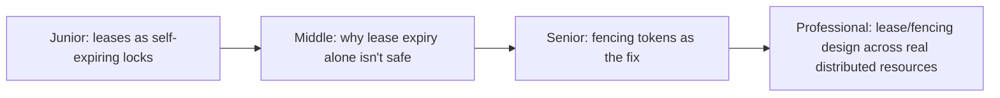
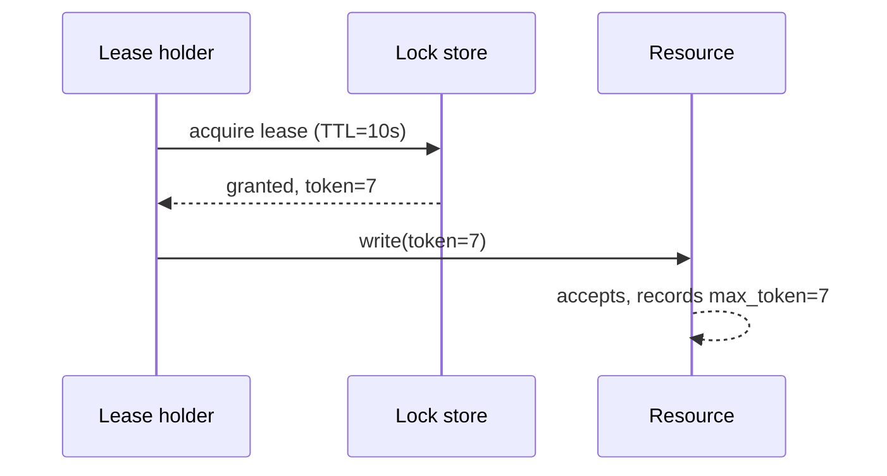

# Leases & Fencing

> A lease is a time-bounded right to do something — hold a lock, act as
> leader — that expires automatically if not renewed. A fencing token makes
> that lease safe to rely on even when the lease-holder's own belief about
> its status is wrong. This is the generalized version of the pattern
> already covered concretely in Leader Election.

## Choose a level

| Level | Guide | You are done when |
|---|---|---|
| Junior | [Leases as self-expiring locks](junior.md) | You can explain why a lease is safer than a lock with no expiry at all. |
| Middle | [Why expiry alone isn't safe](middle.md) | You can construct a scenario where a lease expires but the holder still acts. |
| Senior | [Fencing tokens](senior.md) | You can design a fencing check that rejects a stale lease-holder's write. |
| Professional | [Lease/fencing design across real resources](professional.md) | You can apply fencing to a resource that doesn't natively support version checks (e.g. a physical device or a legacy API). |

## Practice rule

For any lease-based lock in your system, ask: "if the holder is paused
(GC, VM migration, slow disk) for longer than the lease TTL, and then wakes
up and acts — what stops it?" If the answer isn't a specific fencing
mechanism at the resource itself, the lease alone isn't enough.

## Related

- [Leader Election](../leader-election/README.md)
- [Distributed Lock with Fencing](../../distributed-transaction/distributed-lock-with-fencing/README.md)
