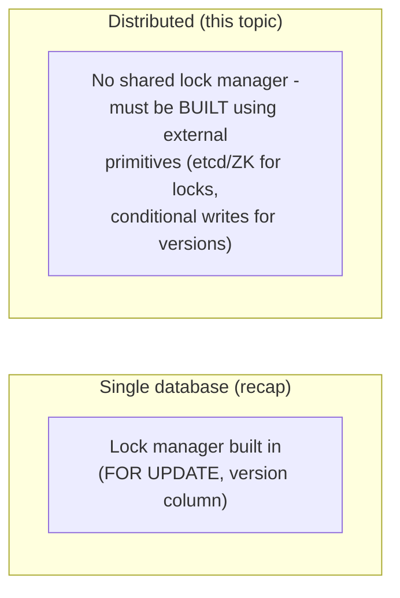

# Optimistic vs. Pessimistic Locking — Junior

<!-- level-focus -->
At junior level, focus on this question:

> How does the optimistic/pessimistic choice from a single database change
> when the resource is shared across multiple independent services with no
> common lock manager?

---

## The same idea, harder setting

[Locking & Concurrency Control — senior](../../../databases/transaction/locking-and-concurrency-control/senior.md)
covered this choice **inside one database**, where the engine provides both
options natively (`SELECT ... FOR UPDATE` for pessimistic, a version column
for optimistic). In a distributed system, the "resource" might be:
inventory tracked by one service, a booking slot managed by another, a
shared configuration value read by a dozen services — and **there is no
single database transaction manager overseeing all of them.**

## The two options, restated for this setting

| | Pessimistic (distributed) | Optimistic (distributed) |
|---|---|---|
| Mechanism | Acquire a distributed lock (via etcd/ZooKeeper — see [Coordination Services](../coordination-services/README.md)) before touching the resource | Read the resource's current version, act, then write conditionally on that version still being current (a conditional/compare-and-swap write) |
| Failure mode if wrong | A crashed lock-holder can block everyone else — needs a lease (see [Leases & Fencing](../leases-and-fencing/README.md)) | A conflicting concurrent write causes your write to be rejected — you must retry |

> 🎓 **Takeaway:** the fundamental trade-off (lock first vs. verify at
> commit time) is identical to the single-database case — what's different
> is that **both options must now be explicitly built** using distributed
> primitives (a coordination service for locks, conditional writes for
> optimistic checks) rather than being provided for free by one database
> engine.

## Test yourself

1. Why can't you just use `SELECT ... FOR UPDATE` when the "resource" is
   actually state split across two different services' separate databases?
2. What distributed primitive would you reach for to implement a
   pessimistic lock across services, based on topics elsewhere in this
   folder?
3. What distributed primitive would you reach for to implement an
   optimistic check across services?

Continue to [`middle.md`](middle.md).
