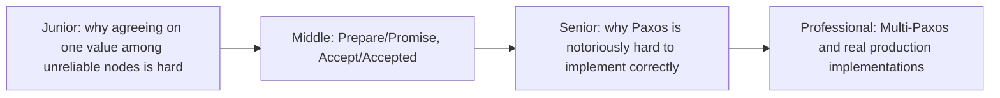
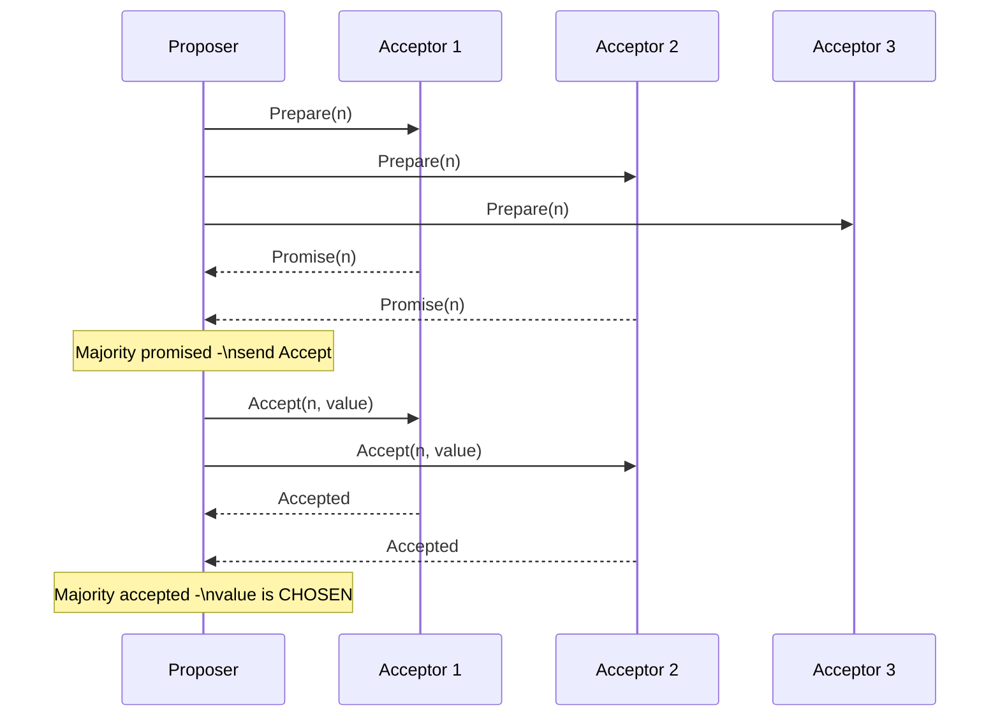

# Paxos

> The original proof that a group of unreliable nodes can agree on a single
> value even if some fail — the theoretical foundation almost every modern
> consensus system (including Raft) either implements directly or was
> designed as a more understandable alternative to.

## Choose a level

| Level | Guide | You are done when |
|---|---|---|
| Junior | [Why this problem is hard](junior.md) | You can explain why a simple majority vote isn't enough when nodes can fail mid-protocol. |
| Middle | [The two-phase protocol](middle.md) | You can walk through Prepare/Promise and Accept/Accepted for a small example. |
| Senior | [Why it's notoriously hard](senior.md) | You can explain a specific edge case (dueling proposers, or the safety proof's subtlety) that makes naive implementations wrong. |
| Professional | [Multi-Paxos in production](professional.md) | You can explain how Multi-Paxos amortizes the protocol's cost and compare it to Raft's approach to the same problem. |

## Practice rule

Before trusting any "we implemented Paxos" claim, ask: "does a promised-but-
not-yet-accepted proposal ever get silently forgotten if a new, higher-
numbered proposal starts?" If the answer isn't a confident, specific "no,
because...", the implementation likely has a subtle safety bug — this
question is `senior.md`'s entire point.

## Related

- [Raft](../raft/README.md)
- [Leader Election](../leader-election/README.md)
