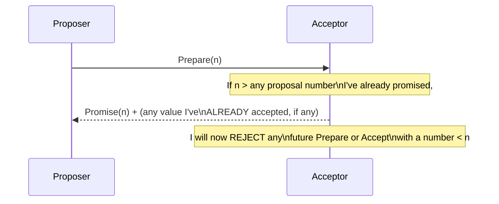
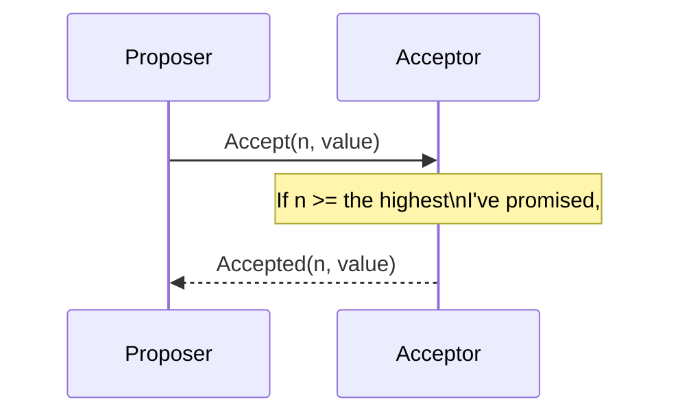
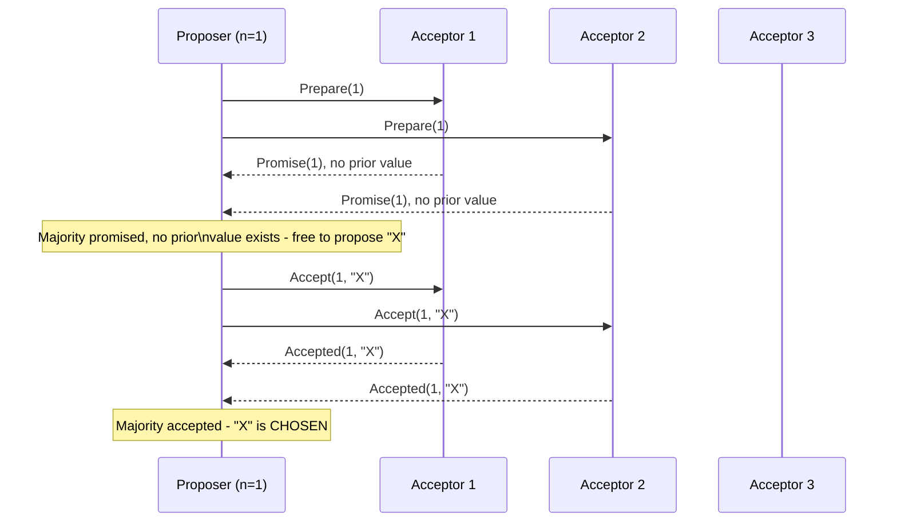

# Paxos — Middle

<!-- level-focus -->
At middle level, focus on this question:

> How do the two phases — Prepare/Promise and Accept/Accepted — actually
> guarantee agreement?

Prerequisite: [`junior.md`](junior.md).

---

## Phase 1: Prepare / Promise

A proposer picks a **proposal number** `n` (must be unique and, across all
proposers, monotonically comparable — typically `(counter, proposer_id)`)
and sends `Prepare(n)` to all acceptors.

An acceptor **promises** not to accept any future proposal numbered lower
than `n` — and critically, if it has **already accepted** some value under
an earlier proposal, it tells the proposer what that value was. This is the
mechanism that lets a new proposer discover and preserve a value that might
already be on its way to being chosen, rather than accidentally proposing a
different value and creating ambiguity.

## Phase 2: Accept / Accepted

If the proposer receives promises from a **majority** of acceptors, it
sends `Accept(n, value)` — but the `value` must be the value from the
**highest-numbered proposal** already accepted by any acceptor that
responded in Phase 1 (if any exist); only if *no* acceptor had already
accepted anything can the proposer choose its own preferred value freely.

Once a **majority** of acceptors have accepted the same `(n, value)`, that
value is **chosen** — permanently, forever, by the protocol's guarantee.

## Worked trace

> 🎓 **Takeaway:** Phase 1 is a proposer "clearing the way" and discovering
> whether it must adopt an already-in-flight value; Phase 2 is actually
> getting a value accepted by a majority. The rule "adopt the highest-numbered
> already-accepted value you learn about" is the specific mechanism that
> prevents two different values from ever being chosen.

## Test yourself

1. Why must an acceptor tell the proposer about any value it already
   accepted, rather than just promising and staying silent about it?
2. In the worked trace, what would the proposer be required to do
   differently if Acceptor 1 had responded with "Promise(1), already
   accepted (n=0, value='Y')"?
3. Why does a proposal need a majority of BOTH promises (Phase 1) AND
   accepts (Phase 2), rather than just one or the other?

Continue to [`senior.md`](senior.md).
