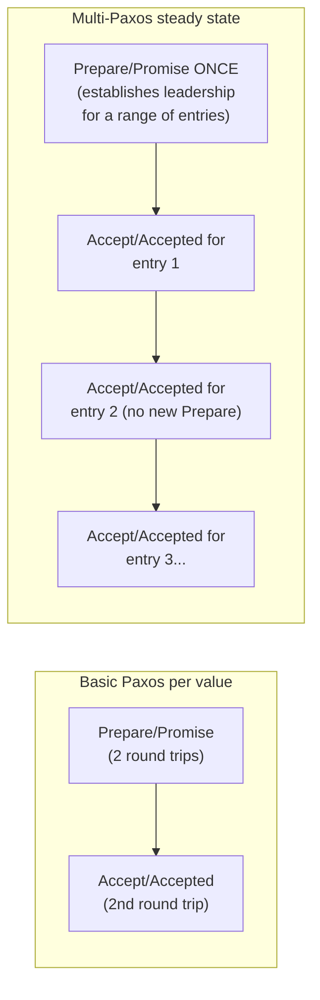
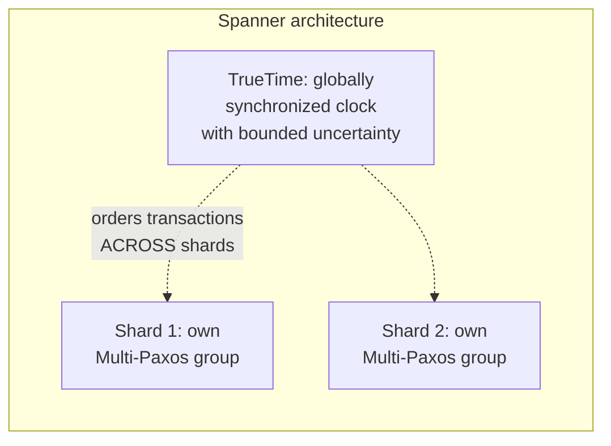

# Paxos — Professional

<!-- level-focus -->
At professional level, focus on this question:

> How does Multi-Paxos amortize the base protocol's per-value cost for a
> continuous log, and how do real production systems (Chubby, Spanner)
> actually deploy it?

Prerequisite: [`senior.md`](senior.md).

---

## Multi-Paxos: amortizing Phase 1 across many log entries

Running the full two-phase protocol (`middle.md`) for **every single log
entry** is prohibitively expensive — two full round trips per value, for
every write. **Multi-Paxos** observes that if the **same proposer** remains
the distinguished leader (`senior.md`'s livelock mitigation) across many
consecutive log entries, Phase 1 (`Prepare`/`Promise`) only needs to run
**once** to establish that leader's right to propose for a *range* of log
positions — subsequent entries skip straight to Phase 2
(`Accept`/`Accepted`), reducing the steady-state cost per committed entry
from two round trips to one.



This is, structurally, exactly what Raft's `AppendEntries` heartbeat
mechanism does (see the Leader Election professional page) — Raft can be
understood as a **specific, more prescriptive instance of Multi-Paxos**,
with the leader-election mechanism and log-matching rules made explicit and
mandatory rather than left as an implementation choice on top of the base
protocol, which is precisely the "understandability" improvement `senior.md`
described.

## Google Chubby: Paxos as a production lock service

Chubby (Google's internal distributed lock/coordination service, the
direct ancestor of etcd/ZooKeeper's role in modern systems) is built on
Multi-Paxos and is extensively documented in Burrows's 2006 paper — notably,
the paper spends significant space on **operational lessons** rather than
protocol theory: the need for periodic **snapshotting** (compacting the
Paxos log so a replica can catch up without replaying the entire history
from the beginning of time), the observed importance of a well-tuned
**master lease** mechanism to avoid unnecessary leader changes under
transient network blips, and the discovery that most production outages
traced back to **operational and configuration issues**, not the consensus
algorithm itself being wrong — a documented, professional-level lesson that
the hardest part of running consensus-based systems at scale is often not
the algorithm but the surrounding operational tooling (monitoring,
snapshotting, capacity planning for log growth).

## Google Spanner: Paxos per shard, TrueTime for global ordering

Spanner (referenced in the Backup & Recovery professional page for its
coordinated-snapshot mechanism) runs **one independent Multi-Paxos group per
data shard** (analogous to CockroachDB's per-range Raft groups from the
Partitioning & Sharding professional page) — consensus is used specifically
for **replicating each shard's writes**, while **TrueTime** (Spanner's
globally-synchronized clock with bounded uncertainty, backed by GPS and
atomic clocks in Google's datacenters) provides the separate mechanism for
globally ordering transactions **across** shards without requiring a single
global consensus instance — a professional-level architectural lesson:
consensus solves replication-within-a-partition; a different mechanism
(TrueTime, or logical clocks in systems without specialized hardware) is
needed for cross-partition global ordering, and conflating the two
responsibilities into one mechanism doesn't scale.



## Production checklist (staff-level)

1. **Use Multi-Paxos (or a Raft-based system, which is effectively the same
   idea with mandatory structure) rather than re-running basic Paxos per
   value** for any system requiring a continuous replicated log — the cost
   difference at scale is substantial and well-documented.
2. **Budget for log snapshotting/compaction as a first-class operational
   requirement** from day one, per Chubby's documented experience — an
   ever-growing, unsnapshotted consensus log is a predictable, well-known
   operational failure mode, not a surprising edge case.
3. **Tune leader lease duration against your actual network jitter
   profile**, per Chubby's master-lease lesson — too short causes
   unnecessary leader churn under normal network variance; too long delays
   genuine failure recovery.
4. **Separate "replication within a partition" (consensus) from "ordering
   across partitions" (a different mechanism — TrueTime, HLCs, or
   application-level coordination) architecturally**, per Spanner's design —
   don't expect one consensus group to solve both problems as a system
   scales beyond a single shard.
5. **In an incident postmortem for a consensus-based system, check
   operational/configuration causes first**, per Chubby's own documented
   experience that most real outages were operational, not algorithmic —
   this reframes where to look before assuming a protocol-level bug.

## Cheat Sheet

```text
+------------------------------------------------------------------+
|                    PAXOS — INTERNALS & SCALE                        |
+------------------------------------------------------------------+
| Multi-Paxos: run Prepare/Promise ONCE to establish a stable leader     |
| across many log entries; subsequent entries skip straight to           |
| Accept/Accepted - amortizes 2 round trips/entry down to 1 in           |
| steady state. Raft = Multi-Paxos with the leader-election and          |
| log-matching rules made explicit and mandatory                        |
+------------------------------------------------------------------+
| Chubby (Google): Multi-Paxos-based lock service. Documented             |
| operational lessons: snapshotting is REQUIRED (unbounded log growth    |
| otherwise), master lease tuning matters (too short = churn, too long   |
| = slow failure recovery), MOST OUTAGES WERE OPERATIONAL, not            |
| algorithmic - a real, documented professional-level lesson             |
+------------------------------------------------------------------+
| Spanner: ONE Multi-Paxos group PER SHARD (replication within a         |
| partition) + TrueTime (globally synchronized clock w/ bounded          |
| uncertainty) for ordering ACROSS shards - consensus and cross-         |
| partition ordering are SEPARATE mechanisms, don't conflate them        |
+------------------------------------------------------------------+
```

## Test yourself

1. Explain precisely why Multi-Paxos can skip Phase 1 for subsequent log
   entries once a stable leader is established, and what would force a new
   Phase 1 round to be needed again.
2. Why does Chubby's documented experience (most outages being operational,
   not algorithmic) matter for how you'd staff and prioritize work on a
   consensus-based system your team operates?
3. Why can't Spanner simply run one giant global Paxos group across all
   shards instead of one per shard plus TrueTime? What would that cost?

## Further Reading

- Lamport — "Paxos Made Simple" (2001 — a more accessible rewrite of the
  original 1998 "The Part-Time Parliament" paper).
- Burrows — "The Chubby Lock Service for Loosely-Coupled Distributed
  Systems" (OSDI 2006 — the operational-lessons-heavy production paper
  referenced above).
- Corbett et al. — "Spanner: Google's Globally-Distributed Database"
  (OSDI 2012 — per-shard Paxos plus TrueTime).
- See also: [Raft — professional](../raft/professional.md),
  [Leader Election — professional](../leader-election/professional.md).
