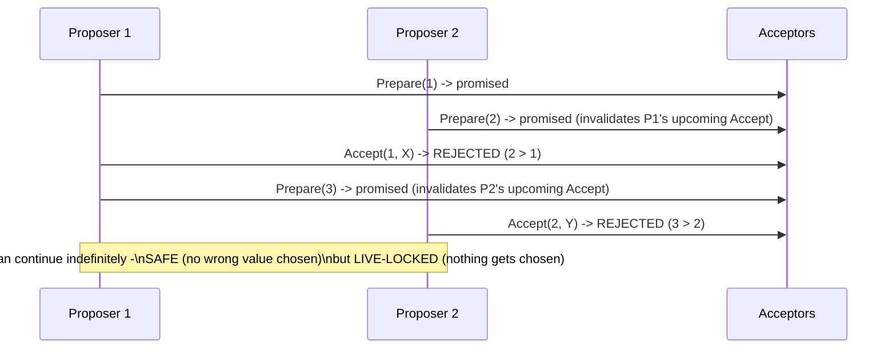
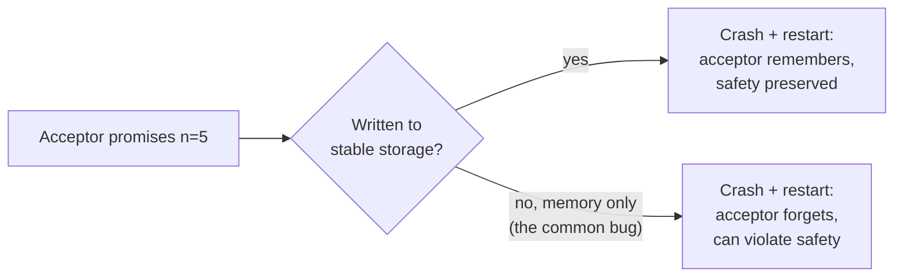

# Paxos — Senior

<!-- level-focus -->
At senior level, focus on this question:

> Why has Paxos gained a reputation as notoriously difficult to implement
> correctly, even though the protocol description in `middle.md` looks
> fairly short?

Prerequisite: [`middle.md`](middle.md).

---

## Dueling proposers: liveness, not safety, is the practical failure mode

`middle.md`'s protocol guarantees **safety** (two different values are
never chosen) even under adversarial conditions — but it does **not**
guarantee **liveness** (that *some* value ever actually gets chosen in a
timely way). Two proposers can perpetually leapfrog each other with
higher and higher proposal numbers, each invalidating the other's in-flight
proposal before it completes:

This is why virtually every production Paxos deployment adds a **distinguished
proposer / leader election** on top of raw Paxos: by ensuring (with high
probability, via the same election mechanisms covered in
[Leader Election](../leader-election/README.md)) that only one node is
actively proposing at a time, the dueling-proposer livelock becomes rare in
practice — but this is an **engineering addition on top of the base
protocol**, not something Lamport's original Paxos paper specifies, and
getting the leader-election layer wrong reintroduces exactly this livelock
risk.

## The subtlety that trips up naive implementations

The single most common correctness bug in from-scratch Paxos
implementations: forgetting that an acceptor's promise **must be persisted
to stable storage before responding** — if an acceptor crashes and
restarts, it must remember every promise and every accepted value it ever
made, or it can violate safety by promising something to a new proposer
that contradicts a promise it forgot making before the crash. This
requirement — **every state change an acceptor makes must survive a crash
and restart** — is easy to state and easy to accidentally skip in a
first implementation (e.g. storing promises only in memory "for now"), and
the resulting bug is subtle: the system appears to work correctly in every
test that doesn't specifically simulate a crash-and-restart at exactly the
wrong moment.

## Why Raft was explicitly created as a response to this

Ongaro and Ousterhout's Raft paper (referenced in the Leader Election
professional page) opens by explicitly citing Paxos's difficulty as its
motivation: Paxos's core two-phase protocol is compact, but building a
complete, practical system (handling log replication, membership changes,
snapshotting) on top of raw Paxos requires substantial additional design
work that Lamport's original papers left as an exercise, and different
teams' independent extensions historically diverged in incompatible,
hard-to-verify ways. Raft's explicit design goal was **understandability as
a first-class engineering property**, decomposing the problem
(leader election, log replication, safety) into more clearly separated
pieces specifically to reduce this class of subtle implementation bug.

> 🎯 **Senior takeaway:** Paxos's core safety proof is compact and correct;
> the difficulty is almost entirely in (a) building a practical, complete
> system on top of the bare two-phase protocol, and (b) implementing every
> crash-recovery/persistence requirement correctly, which is easy to get
> subtly wrong in ways that don't show up until a specific failure sequence
> occurs in production.

## Test yourself

1. Why is the dueling-proposers scenario a liveness problem rather than a
   safety violation — what property of the protocol still holds even during
   an infinite duel?
2. Explain precisely why an acceptor forgetting a promise after a crash-
   restart can lead to two different values being chosen, walking through a
   concrete sequence.
3. Why did Raft's authors treat "understandability" as an explicit design
   goal on equal footing with correctness, rather than treating it as a
   secondary concern to optimize after correctness was established?

Continue to [`professional.md`](professional.md) to see how Multi-Paxos and
real production systems address these issues.
