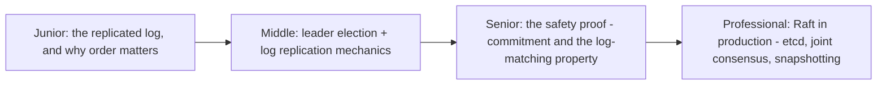
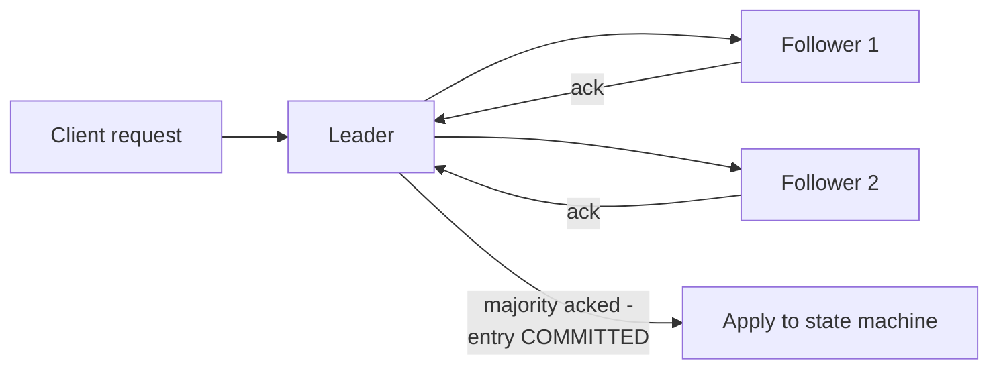

# Raft

> Consensus, designed to be understood. Raft decomposes the problem into
> leader election, log replication, and safety — each explained and proven
> separately — and became the default choice (etcd, Consul, CockroachDB,
> Kafka KRaft) precisely because teams could implement it correctly without
> a PhD in distributed systems theory.

## Choose a level

| Level | Guide | You are done when |
|---|---|---|
| Junior | [The replicated log](junior.md) | You can explain why every node must apply the same commands in the same order to stay consistent. |
| Middle | [Leader election + log replication](middle.md) | You can trace how a client write becomes a committed, replicated log entry. |
| Senior | [The safety proof](senior.md) | You can explain the Log Matching Property and why it guarantees replicas never diverge. |
| Professional | [Raft in production](professional.md) | You can explain joint consensus for membership changes and real snapshotting/log-compaction trade-offs. |

## Practice rule

For any Raft-based system you operate, be able to answer: "what exactly
happens to an in-flight write if the leader crashes the instant after
receiving it, but before replicating it to any follower?" If you can trace
this precisely through commit rules, you understand Raft's actual
guarantee, not just its reputation for simplicity.

## Related

- [Paxos](../paxos/README.md)
- [Leader Election](../leader-election/README.md)
