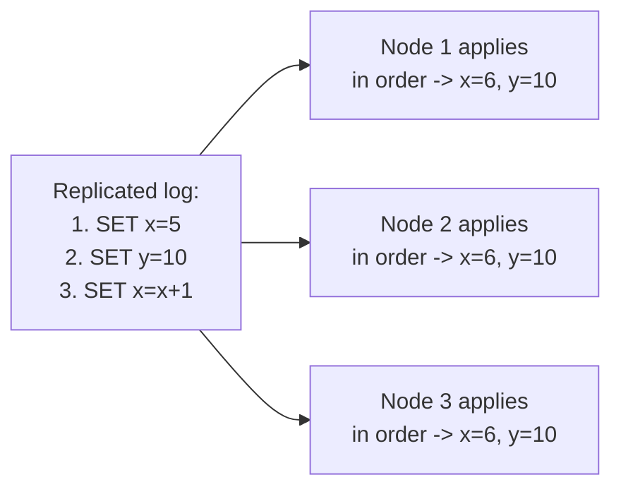
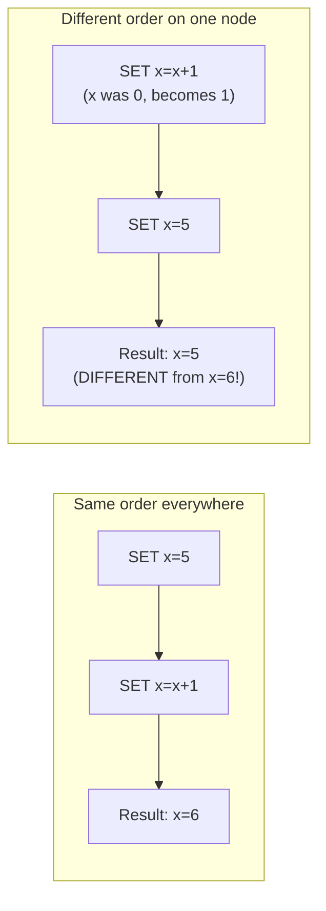

# Raft — Junior

<!-- level-focus -->
At junior level, focus on this question:

> Why must every replica apply the exact same commands in the exact same
> order to stay in sync?

---

## The replicated state machine model

Raft's purpose is to keep a **replicated log** identical across every node
in a cluster, so that each node can independently apply the log's commands
to its own local copy of some state machine and always end up with the
**same result**.

## Why order matters, concretely

`SET x=x+1` and `SET x=5` produce a **different final result** depending on
which order they're applied in — this is why Raft's core guarantee isn't
just "every node eventually gets every command" but specifically **"every
node applies commands in the identical order."** Without that guarantee,
nodes that should be identical replicas of the same system can silently
diverge into different states, which is exactly the kind of bug that's
catastrophic precisely because it's invisible until something reads
different values from different replicas.

> 🎓 **Takeaway:** Raft's job is to make a distributed system behave as if
> it were a single, non-distributed, always-available machine, from the
> perspective of "what order did commands happen in." Everything else in
> this topic — leader election, log replication, the safety proof — exists
> in service of guaranteeing that one property, under every possible
> combination of crashes and network delays.

## Test yourself

1. Construct your own example (besides `x = x + 1`) of two commands whose
   final result depends on their application order.
2. Why isn't "every node eventually receives every command" (with no
   ordering guarantee) sufficient for a replicated state machine to work
   correctly?
3. If two nodes somehow applied commands in different orders and ended up
   with different final states, what would that mean for a client reading
   from one node versus the other?

Continue to [`middle.md`](middle.md).
