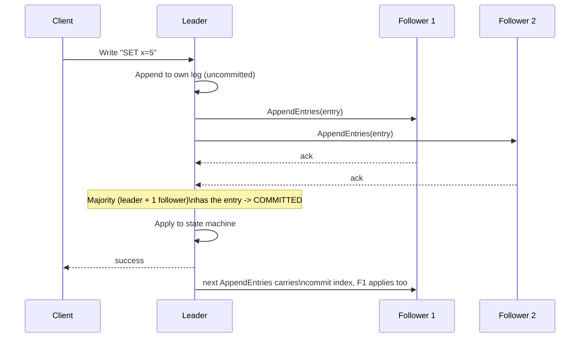

# Raft — Middle

<!-- level-focus -->
At middle level, focus on this question:

> How does a client's write actually become a committed, replicated log
> entry, from request to durable, agreed-upon state?

Prerequisite: [`junior.md`](junior.md).

---

## From client request to committed entry

(Leader election itself — how a leader is chosen — is covered in depth in
[Leader Election — professional](../leader-election/professional.md); this
page assumes a leader already exists and focuses on log replication.)



A log entry is **committed** once it's been replicated to a **majority** of
the cluster (including the leader itself) — this majority requirement is
exactly the same mechanism from [Leader Election](../leader-election/README.md)
that prevents two leaders from both being elected: any future majority must
overlap with this one in at least one node, so a committed entry can never
be "forgotten" by a subsequent leader.

## `AppendEntries` also serves as the heartbeat

The same RPC used to replicate log entries is sent periodically (even with
an empty entry list) as a **heartbeat** — this is what resets followers'
election timeouts (see Leader Election — junior) and is why "log
replication" and "leader liveness" are unified into one mechanism in Raft,
rather than two separate protocols.

## The log consistency check: `prevLogIndex` and `prevLogTerm`

Every `AppendEntries` RPC includes the index and term of the entry
**immediately preceding** the new one(s) being sent. A follower **rejects**
the RPC if its own log doesn't have a matching entry at that position —
forcing the leader to walk backward and resend from an earlier point until
it finds an index where the follower's log agrees, then overwrite anything
after that point with the leader's version.

```mermaid
flowchart LR
    Leader["Leader log:\n[1:x][2:y][3:z]"] -->|"AppendEntries(prevIndex=2,\nprevTerm=matches)"| Follower["Follower log:\n[1:x][2:y]\n(matches at index 2)"]
    Follower -->|accepts, appends [3:z]| Result["Follower log:\n[1:x][2:y][3:z]"]
```

This consistency check is the mechanism that guarantees **followers never
have gaps or divergent history relative to the leader** — any inconsistency
is actively detected and repaired on the very next replication attempt,
rather than silently accumulating.

> 🎓 **Takeaway:** commitment via majority replication, heartbeat-via-
> AppendEntries, and the prevLogIndex/prevLogTerm consistency check together
> form the mechanical core of how Raft turns "a client wants to write
> something" into "every node in the cluster provably has the same,
> correctly-ordered log."

## Test yourself

1. Why must a log entry be replicated to a *majority*, not just "at least
   one other node," before being considered committed?
2. Trace what happens if a follower's log has a gap (missing entry 2 but
   has entry 1 and 3) — how does the `prevLogIndex`/`prevLogTerm` check
   detect and fix this on the next `AppendEntries`?
3. Why does unifying heartbeats with the log-replication RPC (rather than
   using two separate messages) simplify the protocol?

Continue to [`senior.md`](senior.md).
