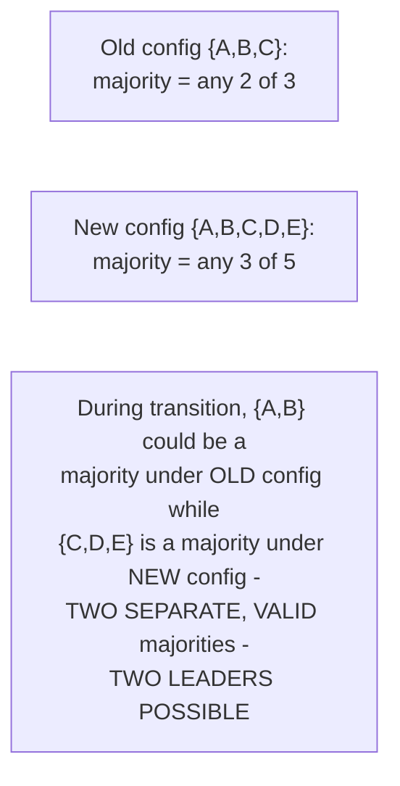
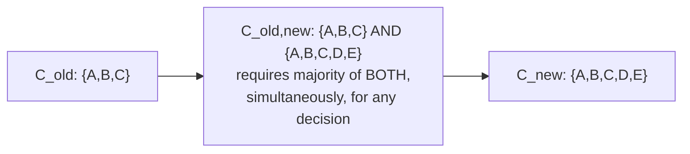
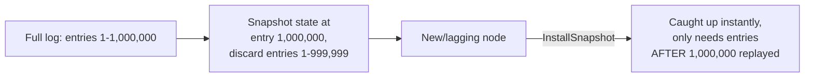

# Raft — Professional

<!-- level-focus -->
At professional level, focus on this question:

> How does Raft safely change cluster membership without a moment of
> ambiguity about who forms a majority, and how do real systems (etcd)
> handle the unbounded log-growth problem?

Prerequisite: [`senior.md`](senior.md).

---

## The membership-change problem: two different majorities can both be "correct" mid-transition

Naively switching a cluster's configuration from `{A, B, C}` to
`{A, B, C, D, E}` in one atomic step is unsafe: during the transition
window, if some nodes have the old config and some have the new one, it's
possible for **two disjoint majorities** to exist simultaneously — one
majority under the old 3-node config, and a *different* majority under the
new 5-node config — potentially electing two different leaders at once,
directly violating Raft's core safety guarantee.



## Joint consensus: the mechanism that closes this gap

Raft's original paper (and most production implementations) solve this with
**joint consensus**: introduce an intermediate configuration
`C_old,new` where **any decision (election or commitment) requires a
majority from BOTH the old config AND the new config simultaneously**. Only
once this joint configuration is itself committed does the cluster switch
to `C_new` alone.



During the joint phase, it's mathematically impossible for two disjoint
majorities to both make progress independently, because any valid decision
requires simultaneous majority agreement under both the old and new rules —
this closes the exact gap the naive one-step switch leaves open. Many
production implementations (etcd's Raft library among them) instead use a
simpler, more restrictive but easier-to-implement approach: **change
membership one node at a time**, which the Raft paper also proves is safe
without needing the full joint-consensus machinery, at the cost of
membership changes taking longer (each individual add/remove must fully
complete before the next begins) — a real, explicit implementation-
complexity-vs-flexibility trade-off production systems make deliberately.

## Snapshotting: the answer to "the log grows forever"

A Raft log that's never compacted grows unboundedly, and a new (or
badly-lagging) node joining the cluster would need to replay the **entire**
history from the beginning — infeasible for a long-lived production system.
**Snapshotting** solves this: periodically, a node serializes its entire
current state machine state into a compact snapshot, then discards all log
entries up to that point. A lagging or new node receives the snapshot
directly (via an `InstallSnapshot` RPC) instead of replaying potentially
millions of individual log entries.



etcd's production implementation exposes this directly as a tunable
(`--snapshot-count`), and the operational trade-off is real: snapshotting
too infrequently risks long recovery times for lagging nodes and unbounded
disk usage for the log; snapshotting too frequently adds CPU/I/O overhead
from repeatedly serializing the full state — this is a genuine,
workload-dependent capacity-planning decision, not a "set it and forget it"
default.

## Production checklist (staff-level)

1. **Verify your Raft implementation uses joint consensus or the safe
   one-at-a-time membership-change approach explicitly** before performing
   any cluster resize in production — a naive "just update the config on
   every node" approach is exactly the unsafe pattern this page describes.
2. **Tune snapshot frequency against your actual log growth rate and
   acceptable node-recovery time**, not a default value — this is a real,
   measurable capacity-planning trade-off specific to your write volume.
3. **Monitor Raft log size and time-since-last-snapshot as operational
   metrics**, alongside leader-election-rate metrics — unbounded log growth
   from a stalled snapshotting process is a distinct, diagnosable failure
   mode from the leader-election issues covered in the Leader Election
   professional page.
4. **When adding multiple nodes to a cluster, add them one at a time (even
   with joint-consensus support) and confirm each has caught up before
   adding the next**, to minimize the window where cluster availability
   depends on a not-yet-fully-synced node counting toward quorum.
5. **In a design review for a Raft-based system's membership-change
   tooling, ask explicitly which safety mechanism (joint consensus vs.
   one-at-a-time) is implemented**, and verify it against the specific
   library/version in use — this is a well-known area where naive custom
   tooling built around a Raft library can reintroduce unsafety the
   underlying library itself avoided.

## Cheat Sheet

```text
+------------------------------------------------------------------+
|                     RAFT — INTERNALS & SCALE                        |
+------------------------------------------------------------------+
| Membership change danger: switching config in one step can create      |
| TWO DISJOINT valid majorities (old-config majority + new-config        |
| majority) simultaneously -> two possible leaders, safety violated      |
+------------------------------------------------------------------+
| Joint consensus: intermediate C_old,new config requires majority        |
| of BOTH old AND new simultaneously for any decision - closes the       |
| gap. Simpler alternative (etcd and others): one-node-at-a-time          |
| membership changes, also proven safe, less flexible, easier to build   |
+------------------------------------------------------------------+
| Snapshotting: periodically serialize full state machine, discard        |
| log entries before that point - new/lagging nodes get InstallSnapshot  |
| instead of replaying the entire history. Tune frequency against         |
| log growth rate vs. serialization overhead - a real capacity-planning  |
| decision, not a default to ignore                                      |
+------------------------------------------------------------------+
```

## Test yourself

1. Construct a concrete scenario with a 3-node cluster becoming a 5-node
   cluster where a naive one-step config switch could produce two valid
   majorities simultaneously.
2. Why does joint consensus's "majority of both old and new" requirement
   make it mathematically impossible for two disjoint majorities to both
   proceed independently during the transition?
3. A production etcd cluster's log grows to gigabytes with no snapshot
   taken in weeks. What operational risk does this create for a new node
   joining the cluster, and what configuration would you check?

## Further Reading

- Ongaro & Ousterhout — "In Search of an Understandable Consensus
  Algorithm" (the full Raft paper, §6 on cluster membership changes and §7
  on log compaction/snapshotting).
- Diego Ongaro's PhD dissertation — "Consensus: Bridging Theory and
  Practice" (a more detailed treatment of joint consensus and
  single-server membership changes than the conference paper).
- etcd `raft` library documentation — snapshotting configuration and
  membership-change API.
- See also: [Paxos — professional](../paxos/professional.md),
  [Leader Election — professional](../leader-election/professional.md).
