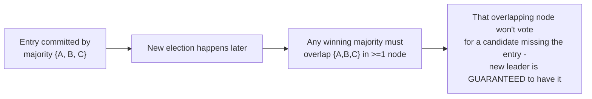

# Raft — Senior

<!-- level-focus -->
At senior level, focus on this question:

> What is the Log Matching Property, and how does it formally guarantee
> replicas can never silently diverge?

Prerequisite: [`middle.md`](middle.md).

---

## The Log Matching Property

Raft's safety proof rests on a specific, provable invariant:

> If two logs contain an entry with the same index and the same term, then
> the logs are identical in **all** entries up through that index.

```mermaid
flowchart LR
    subgraph Guarantee["If entry (index=5, term=3) matches on two logs..."]
        L1["Log A: [...][5:term3][...]"]
        L2["Log B: [...][5:term3][...]"]
        L1 -.-.- L2
        Both["...then entries 1-5 are\nGUARANTEED identical on both,\nnot just entry 5 itself"]
    end
```

This property holds because of two rules enforced together: (1) a leader
creates **at most one** entry per log index within a given term (never
overwrites its own uncommitted entries at the same position), and (2) the
`prevLogIndex`/`prevLogTerm` consistency check from `middle.md` means a
follower only ever accepts a new entry if its immediately preceding entry
already matches — by induction, this guarantees that any matching entry
implies the entire prefix up to it matches too, since the check would have
failed at some earlier point otherwise.

## Why this matters: it reduces "are these logs consistent" to one comparison

Without this property, verifying two replicas agree would require
comparing every single entry in both logs. With it, checking **one** entry
(index + term) is provably sufficient to guarantee agreement on the entire
prefix — this is what makes `AppendEntries`'s consistency check
(`middle.md`) efficient: a leader doesn't need to send or compare the whole
log on every RPC, just the position immediately before the new entries.

## Committed entries are permanent, by construction

The subtlest part of Raft's safety proof: once an entry is committed
(replicated to a majority, per `middle.md`), **it is guaranteed to be
present in the log of every future leader**. This holds because becoming
leader requires votes from a majority (per the "log at least as up-to-date"
rule from [Leader Election — professional](../leader-election/professional.md)),
and that majority must overlap with the majority that committed the entry
in at least one node — a node that has the committed entry will never vote
for a candidate whose log is missing it, because that candidate's log
wouldn't be "at least as up-to-date."



> 🎯 **Senior takeaway:** the Log Matching Property and the majority-overlap
> argument together are *why* Raft can make the strong claim "a committed
> entry is never lost, ever, even across arbitrarily many future leader
> changes" — not as an operational best-effort property, but as a
> mathematical consequence of the majority-quorum rule applied consistently
> to both voting and commitment.

## Test yourself

1. Walk through, using the Log Matching Property, why checking a single
   `(index, term)` pair is sufficient to guarantee two entire log prefixes
   are identical.
2. Explain precisely why a node that has a committed entry will always
   refuse to vote for a candidate whose log doesn't include it.
3. Why does "majority overlap" between the committing majority and any
   future electing majority matter — what would go wrong if elections only
   required, say, a third of the cluster instead of a strict majority?

Continue to [`professional.md`](professional.md) to see how Raft handles
membership changes and log compaction in real production systems.
