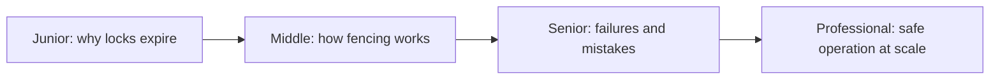
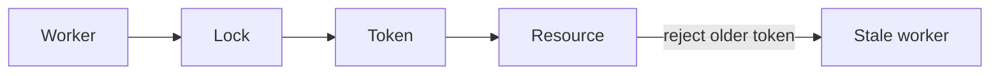

# Distributed Lock with Fencing

> A lease coordinates current ownership; a fencing token lets the resource reject stale owners.

| Level | Guide | You are done when |
|---|---|---|
| Junior | [Definition and why](junior.md) | You can explain stale-holder corruption. |
| Middle | [How it works](middle.md) | You can trace token issuance and enforcement. |
| Senior | [Failures and mistakes](senior.md) | You can test expiry, failover, and contention. |
| Professional | [Best practices and scale](professional.md) | You can design an operable fenced resource. |

**Practice rule:** Never treat possession of a lease as proof that a delayed write is still valid.

## Related
[2PC/3PC](../06-2pc-3pc-coordinator/README.md) | [TCC](../08-tcc-try-confirm-cancel/README.md)
