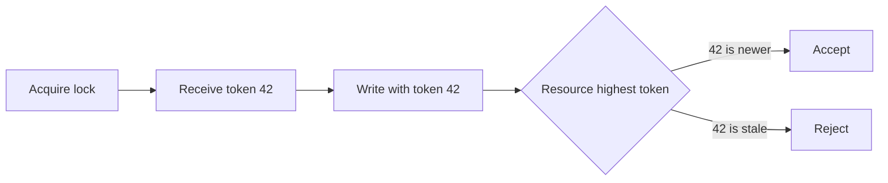

# Distributed Locks with Fencing - Middle

A **fencing token** is a number that increases on every successful acquisition. The resource remembers the highest accepted token and rejects lower tokens.

With etcd, a transaction revision can provide monotonic ordering. With Redis, `SET key owner NX PX ttl` needs owner-checked Lua release and a separately reliable monotonic counter. The write API must carry the token; a lock library alone cannot enforce fencing.

For an Airflow compaction task, store `last_fence` with the table or object manifest and condition every commit on `new_fence > last_fence`.

## Test yourself

1. Where must fencing be enforced?
2. Why is compare-and-delete safer than plain `DEL`?
3. What property must token issuance provide?

Continue to [`senior.md`](senior.md).
