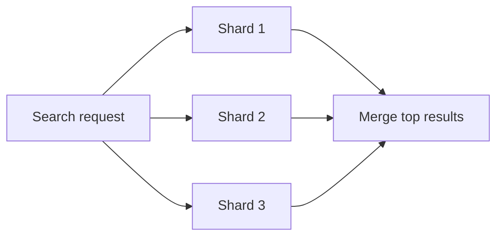

# Scatter-Gather Aggregator - Junior

Scatter-gather sends one request to several independent sources, then combines their replies. A query service may search many data shards in parallel.

The naive implementation waits forever for every shard. One slow branch then controls total latency, and fan-out multiplies backend load. Define whether partial results are acceptable and give all branches one deadline.

## Test yourself

1. Why does one slow shard affect the whole request?
2. What work belongs in gather?
3. Why must fan-out be bounded?

Continue to [`middle.md`](middle.md).
