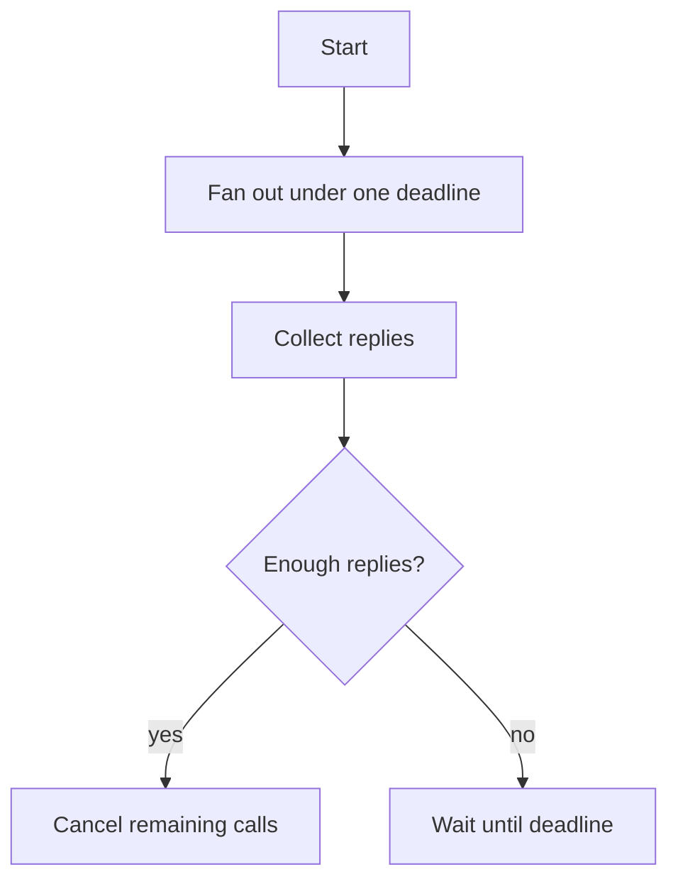

# Scatter-Gather Aggregator - Middle

Choose an explicit completion policy: all responses, first `k`, or best effort until a deadline.

For a federated warehouse catalog search, attach shard identity to every result, deduplicate by object ID, and use a bounded semaphore. A top-k merge keeps one small heap instead of concatenating every result. Propagate cancellation after the policy is satisfied.

## Test yourself

1. When is `k-of-n` preferable to `all-of-n`?
2. How does a heap bound top-k memory?
3. Why cancel unfinished branches?

Continue to [`senior.md`](senior.md).
