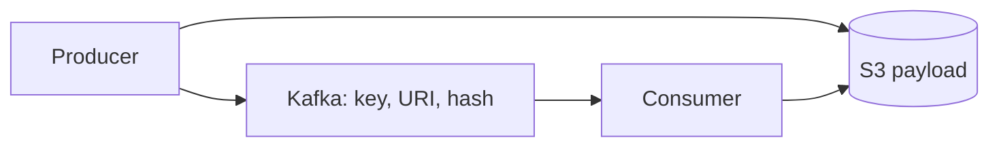

# Claim-Check Pattern - Junior

Large events can exceed broker limits and waste network bandwidth. Claim-check stores the payload in object storage and sends a small reference.

The naive sequence has a gap: a crash after blob upload but before publish leaves an orphan; deleting too early breaks slow consumers. The reference must include identity, size, hash, and format.

## Test yourself

1. What does the broker message contain?
2. How can an orphan blob appear?
3. Why should the consumer verify a hash?

Continue to [`middle.md`](middle.md).
