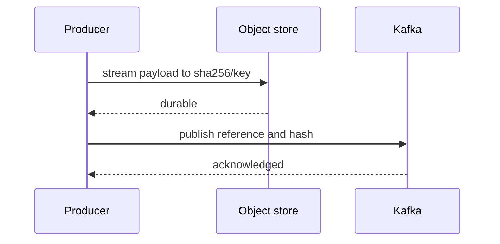

# Claim-Check Pattern - Middle

Use content-addressed keys so retrying an upload creates the same object, then publish only after the upload is durable.

The consumer streams the object, validates size and SHA-256, processes idempotently, and records completion. Lifecycle cleanup must use message retention plus maximum consumer lag and replay policy, not upload age alone.

## Test yourself

1. Why does content addressing make upload retry safe?
2. When may a blob be deleted?
3. Why stream instead of loading the blob into memory?

Continue to [`senior.md`](senior.md).
