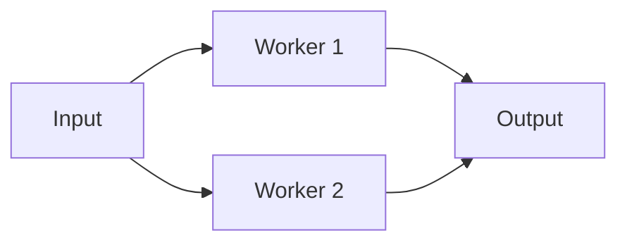

# Fan-Out/Fan-In Pipeline

> Process independent items concurrently, then merge their results with bounded resources.

| Level | Guide | You are done when |
|---|---|---|
| Junior | [Definition and why](junior.md) | You can explain bounded parallelism. |
| Middle | [How it works](middle.md) | You can coordinate workers, closure, and errors. |
| Senior | [Failures and mistakes](senior.md) | You can prevent leaks and overload. |
| Professional | [Best practices and scale](professional.md) | You can allocate end-to-end capacity. |

**Practice rule:** Bound work, queues, and task lifetime together.

## Related
[Scatter-gather](../03-scatter-gather-aggregator/README.md)
