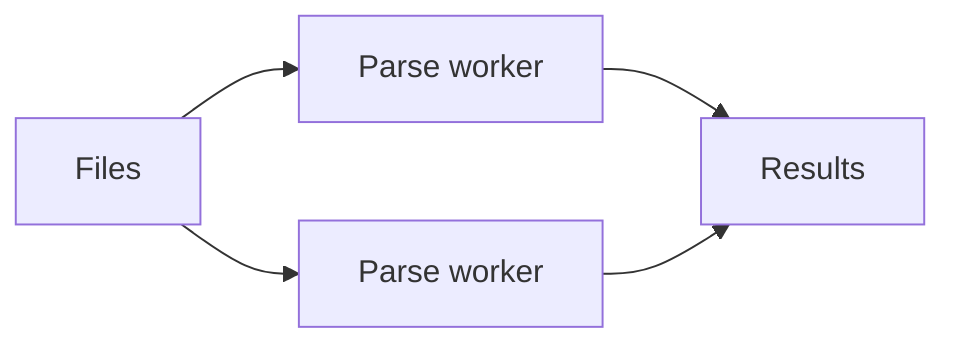

# Fan-Out/Fan-In Pipeline - Junior

Fan-out gives independent items to parallel workers; fan-in combines their results.

Starting one goroutine per object looks simple but can exhaust memory, sockets, or warehouse connections. Use a bounded worker pool and define whether output order matters.

## Test yourself

1. What is fanned out?
2. Why is unlimited concurrency unsafe?
3. What does fan-in own?

Continue to [`middle.md`](middle.md).
