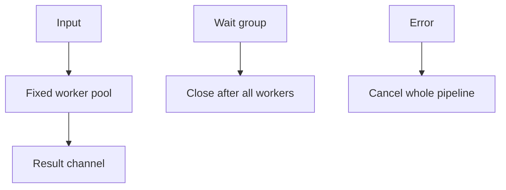

# Fan-Out/Fan-In Pipeline - Middle

Bound concurrency, propagate cancellation, and close output after every producer exits.

For object-store validation, stream keys through a bounded channel, use `errgroup` workers, and attach the input sequence when ordered fan-in is required. Choose fail-fast, collect-all, or best-effort errors before implementation.

## Test yourself

1. Who closes the result channel?
2. How does cancellation stop blocked workers?
3. What does ordered fan-in cost?

Continue to [`senior.md`](senior.md).
