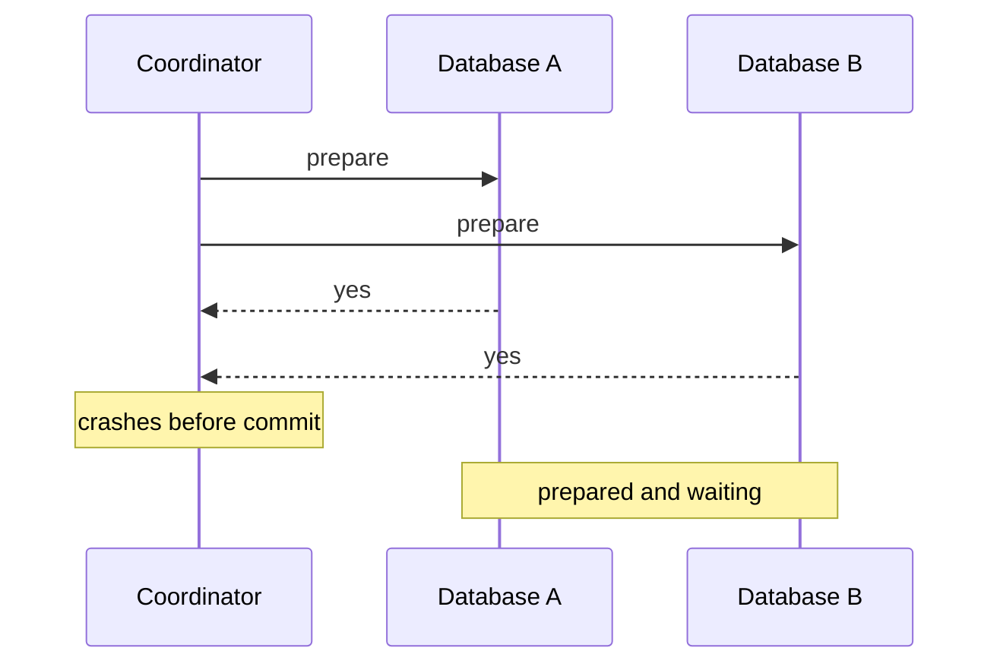

# Two-Phase and Three-Phase Commit - Junior

A distributed transaction wants several databases to make one all-or-nothing decision.

Writing A then B is unsafe: B can fail after A commits. Two-phase commit fixes atomic choice but a coordinator crash can leave participants in doubt and holding locks.

## Test yourself

1. Why is sequential commit not atomic?
2. What does prepared mean?
3. Why can 2PC block?

Continue to [`middle.md`](middle.md).
