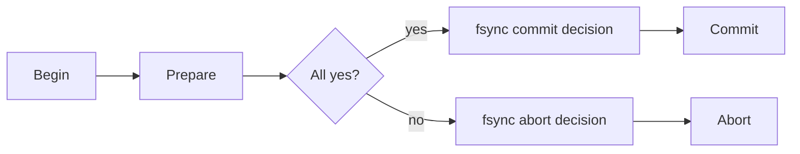

# Two-Phase and Three-Phase Commit - Middle

The coordinator first collects durable votes, then durably records and broadcasts one decision.

PostgreSQL `PREPARE TRANSACTION` persists participant state. The coordinator must fsync its decision before sending it and retry phase two after restart. 3PC adds pre-commit to reduce blocking under timing assumptions, but partitions can violate those assumptions.

## Test yourself

1. Why log before sending commit?
2. What must recovery do with an in-doubt participant?
3. Which assumption makes 3PC unsafe under partitions?

Continue to [`senior.md`](senior.md).
