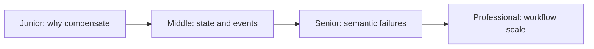
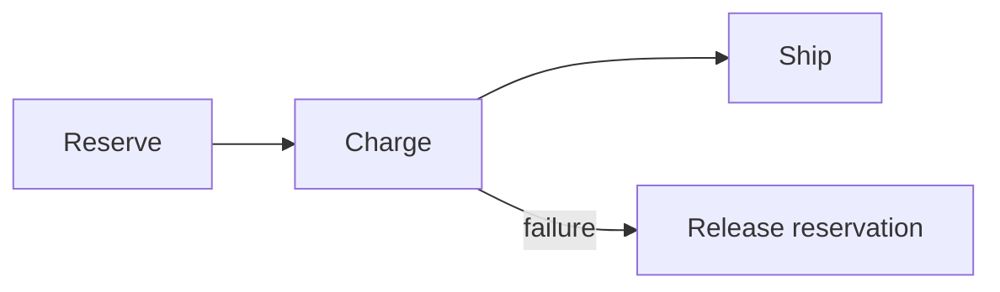

# Saga: Orchestration vs Choreography

> A Saga coordinates local commits and explicit compensations without pretending they are one database transaction.

| Level | Guide | You are done when |
|---|---|---|
| Junior | [Definition and why](junior.md) | You can distinguish compensation from rollback. |
| Middle | [How it works](middle.md) | You can model orchestration and choreography. |
| Senior | [Failures and mistakes](senior.md) | You can handle races, duplicates, and failed compensation. |
| Professional | [Best practices and scale](professional.md) | You can evolve and operate durable workflows. |

**Practice rule:** State business invariants and compensation before choosing coordination style.

## Related
[2PC/3PC](../06-2pc-3pc-coordinator/README.md) | [TCC](../08-tcc-try-confirm-cancel/README.md)
