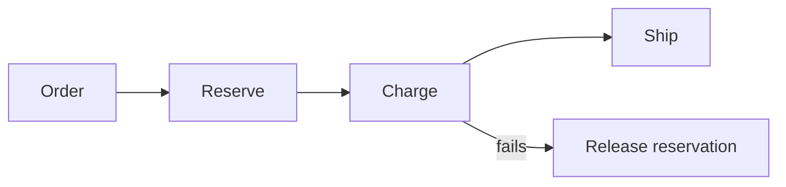

# Saga: Orchestration vs Choreography - Junior

A Saga splits a long transaction into local commits and compensating actions.

There is no database rollback across services. A compensation is a new business action and can also fail. Orchestration uses one coordinator; choreography lets services react to events.

## Test yourself

1. Why is compensation not rollback?
2. What does an orchestrator own?
3. How can choreography hide the workflow?

Continue to [`middle.md`](middle.md).
