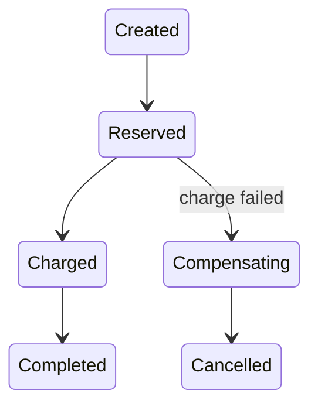

# Saga: Orchestration vs Choreography - Middle

Persist every transition and make forward and compensating commands idempotent.

An orchestrator stores `saga_id`, state, completed steps, and pending command; an outbox publishes that command atomically. Choreography uses correlated events but needs an observable projection of the same state. Identify the pivot step after which compensation is impossible.

## Test yourself

1. Why persist before publishing a command?
2. What makes a handler idempotent?
3. What is a pivot transaction?

Continue to [`senior.md`](senior.md).
