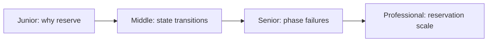
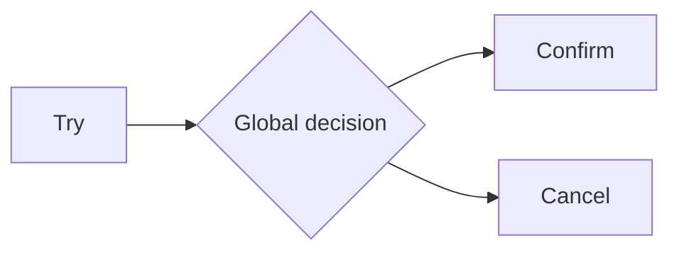

# TCC: Try, Confirm, Cancel

> Reserve resources first, then durably confirm or cancel every reservation.

| Level | Guide | You are done when |
|---|---|---|
| Junior | [Definition and why](junior.md) | You can explain provisional reservation. |
| Middle | [How it works](middle.md) | You can implement idempotent state transitions. |
| Senior | [Failures and mistakes](senior.md) | You can handle reordered phases and expiry. |
| Professional | [Best practices and scale](professional.md) | You can operate reservation protocols at scale. |

**Practice rule:** Treat Confirm and Cancel as durable terminal choices, not best-effort callbacks.

## Related
[2PC/3PC](../06-2pc-3pc-coordinator/README.md) | [Saga](../07-saga-orchestration-vs-choreography/README.md)
