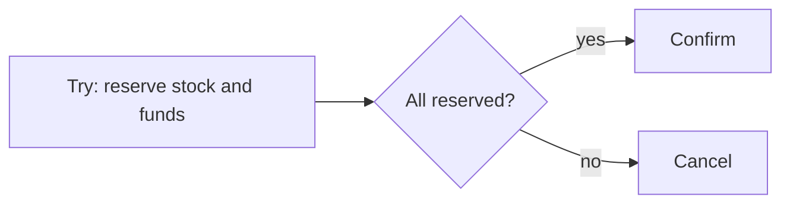

# TCC: Try, Confirm, Cancel - Junior

TCC reserves resources before making the final decision.

Try must not finalize the business action. Confirm consumes the reservation; Cancel releases it. Network retries mean both phase-two operations must be idempotent.

## Test yourself

1. What does Try reserve?
2. Why can Confirm repeat?
3. How is TCC different from a Saga compensation?

Continue to [`middle.md`](middle.md).
