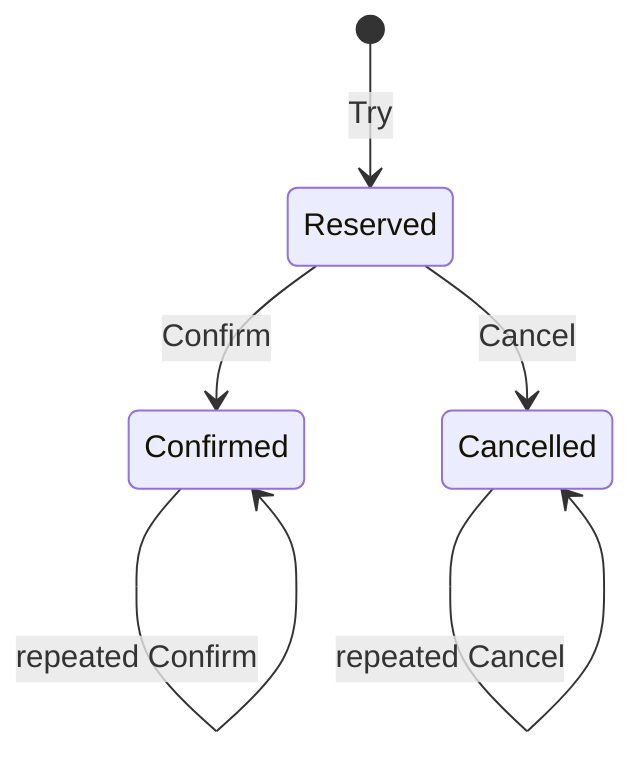

# TCC: Try, Confirm, Cancel - Middle

Each participant stores a reservation keyed by global transaction ID and an explicit terminal state.

Insert a tombstone when Cancel arrives before Try so delayed Try cannot reserve later. Handle empty Confirm explicitly. The coordinator durably records its decision and redrives Confirm or Cancel until every participant acknowledges.

## Test yourself

1. Why keep a Cancel tombstone?
2. Which transitions must be idempotent?
3. What does coordinator recovery redrive?

Continue to [`senior.md`](senior.md).
