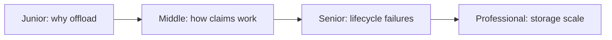
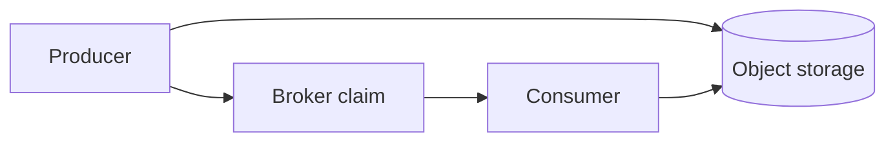

# Claim-Check Pattern

> Keep large payloads in object storage and send a small, verifiable reference through the broker.

| Level | Guide | You are done when |
|---|---|---|
| Junior | [Definition and why](junior.md) | You can explain payload offload and orphan risk. |
| Middle | [How it works](middle.md) | You can publish and verify an immutable claim. |
| Senior | [Failures and mistakes](senior.md) | You can make retention and replay safe. |
| Professional | [Best practices and scale](professional.md) | You can operate integrity and garbage collection. |

**Practice rule:** Publish only durable claims and delete only unreachable blobs.

## Related
[Idempotent inbox/outbox](../../../event-streaming/events-driven/idempotent-inbox-outbox/README.md)
