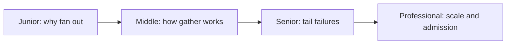
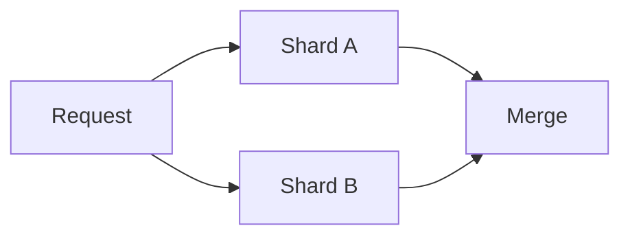

# Scatter-Gather Aggregator

> Query independent branches in parallel and combine enough answers under one deadline.

| Level | Guide | You are done when |
|---|---|---|
| Junior | [Definition and why](junior.md) | You can explain tail amplification. |
| Middle | [How it works](middle.md) | You can choose all-of-n, k-of-n, or best effort. |
| Senior | [Failures and mistakes](senior.md) | You can bound hedging and partial failure. |
| Professional | [Best practices and scale](professional.md) | You can budget latency and fleet load. |

**Practice rule:** Bound fan-out and propagate one end-to-end deadline.

## Related
[Fan-out/fan-in pipeline](../fan-out-fan-in-pipeline/README.md)
