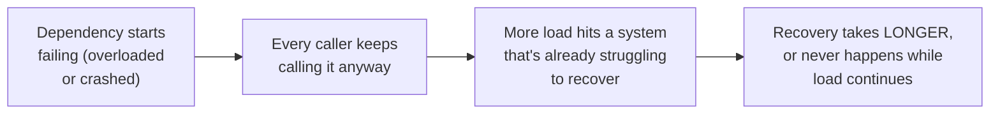
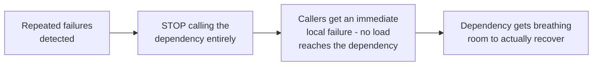

# Circuit Breaker — Junior

<!-- level-focus -->
At junior level, focus on this question:

> Why can continuing to call a failing dependency actually slow down its
> recovery, rather than being harmless?

---

## Piling on a struggling dependency

If a downstream service is overloaded or degraded, every caller that keeps
calling it — even just to get a fast error back — still consumes some of
its capacity: a connection slot, a thread, a bit of CPU parsing the
request before rejecting it. At scale, this ongoing load from every caller
combined can be exactly what prevents an overloaded service from ever
catching up and recovering, turning a temporary blip into a prolonged
outage.

## The idea: stop calling it, on purpose, for a while

A **circuit breaker** deliberately stops sending requests to a dependency
once it's clearly failing, returning an immediate local error to the
caller instead — no network call, no load on the struggling dependency at
all. This is a direct trade: the caller gets a faster, more predictable
failure (instead of waiting for a timeout on every single call), and the
struggling dependency gets relief from load it can't currently handle.

> 🎓 **Takeaway:** a circuit breaker isn't primarily about protecting the
> caller (though fast-failing helps that too) — it's about protecting the
> **dependency** from being kept down by well-intentioned callers who keep
> trying, each one adding a little more load to a system that needs load
> removed, not added, to recover.

## Test yourself

1. Why does even a "fast" rejected request from an overloaded dependency
   still cost that dependency something?
2. How does stopping calls entirely (rather than just retrying with
   backoff) give a struggling dependency more relief?
3. What's the trade-off a caller accepts when a circuit breaker fails fast
   instead of attempting the real call?

Continue to [`middle.md`](middle.md).
