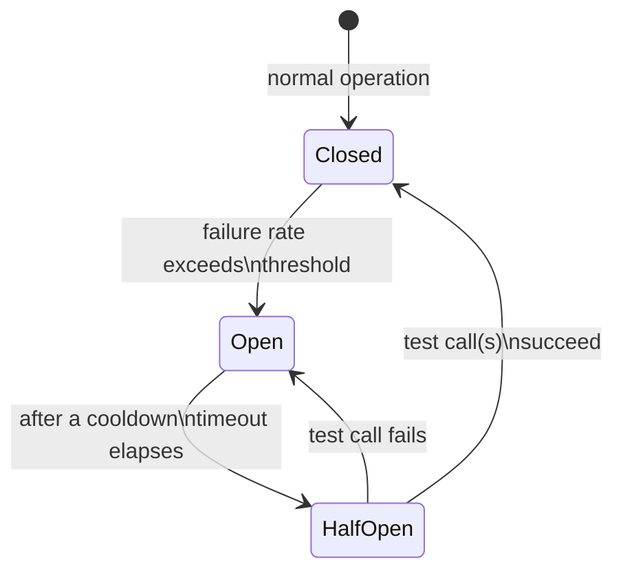
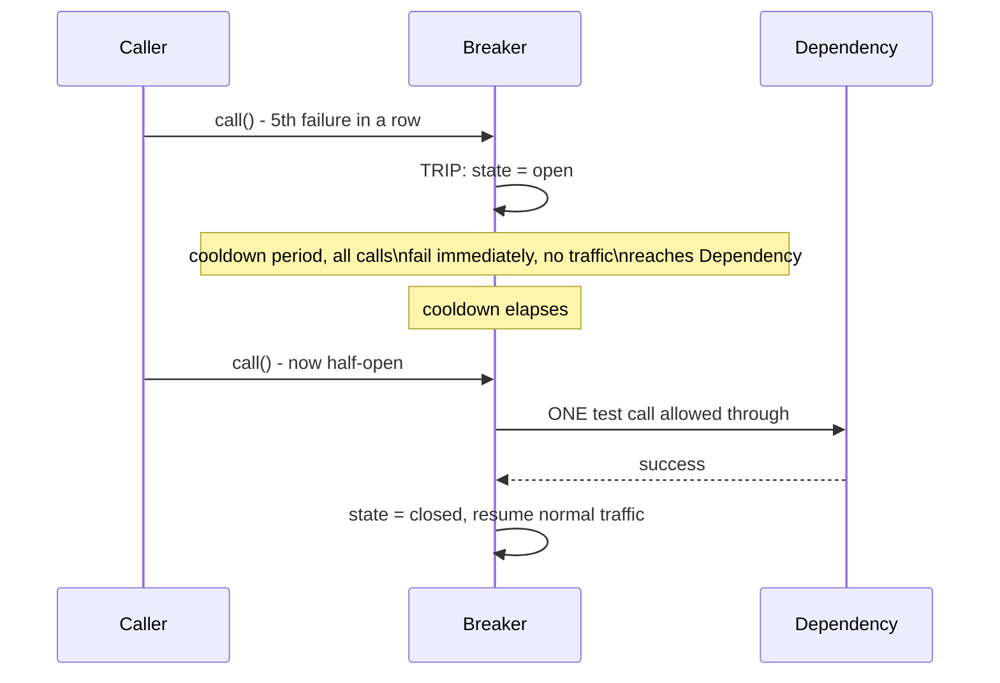

# Circuit Breaker — Middle

<!-- level-focus -->
At middle level, focus on this question:

> How do the three states — closed, open, half-open — work together to
> both stop calling a failing dependency AND detect when it recovers?

Prerequisite: [`junior.md`](junior.md).

---

## The state machine



- **Closed**: normal operation — calls pass through to the dependency, and
  failures are counted.
- **Open**: the breaker has "tripped" — calls **fail immediately, locally**
  (per `junior.md`), with **zero** traffic reaching the dependency, for a
  configured cooldown period.
- **Half-open**: after the cooldown, the breaker allows a **small number**
  of test calls through. If they succeed, it closes (resumes normal
  traffic); if they fail, it reopens (another full cooldown).

## A simplified implementation

```python
class CircuitBreaker:
    def __init__(self, failure_threshold=5, cooldown_seconds=30):
        self.state = "closed"
        self.failure_count = 0
        self.failure_threshold = failure_threshold
        self.cooldown_seconds = cooldown_seconds
        self.opened_at = None

    def call(self, fn):
        if self.state == "open":
            if time.time() - self.opened_at > self.cooldown_seconds:
                self.state = "half_open"
            else:
                raise CircuitOpenError("Failing fast, dependency is down")

        try:
            result = fn()
            if self.state == "half_open":
                self.state = "closed"
                self.failure_count = 0
            return result
        except Exception:
            self.failure_count += 1
            if self.failure_count >= self.failure_threshold or self.state == "half_open":
                self.state = "open"
                self.opened_at = time.time()
            raise
```



> 🎓 **Takeaway:** the half-open state is the mechanism that lets a circuit
> breaker **automatically** detect recovery without a human flipping it
> back on — a small, controlled trickle of test traffic probes whether the
> dependency is healthy again, without exposing it to the full traffic
> volume that would happen if the breaker just closed unconditionally after
> the cooldown.

## Test yourself

1. Why does the breaker allow only a small number of test calls in
   half-open, rather than immediately resuming full traffic?
2. What would happen if the cooldown period were set to 0 seconds — would
   the breaker still provide any protection?
3. In the code example, what happens if a call succeeds while the breaker
   is still `closed` (not open or half-open) — does anything change?

Continue to [`senior.md`](senior.md).
