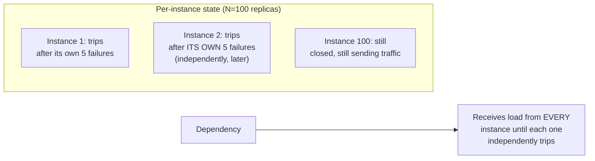
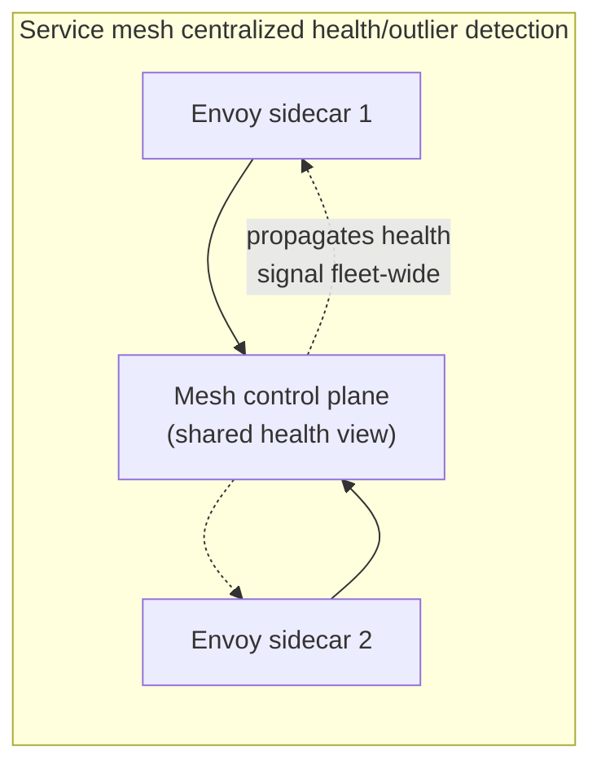

# Circuit Breaker — Professional

<!-- level-focus -->
At professional level, focus on this question:

> Should circuit breaker state be per-instance or shared across a fleet,
> and how do production resilience libraries (resilience4j, Envoy) actually
> implement this trade-off?

Prerequisite: [`senior.md`](senior.md).

---

## Per-instance state: the common, simpler default

Most circuit breaker libraries (resilience4j, Polly, Hystrix historically)
maintain breaker state **independently per process/instance** — each
service replica has its own view of "is this dependency healthy," based
only on the calls **that specific instance** has made. This is simple and
requires no additional coordination infrastructure, but has a real
consequence at scale: with `N` replicas, a dependency failure must be
independently detected and tripped **N separate times** before the whole
fleet stops sending it traffic — during that detection window across all N
instances, the dependency still receives load from every instance that
hasn't yet independently reached its own trip threshold.



## Shared state: faster fleet-wide reaction, at a coordination cost

Some production systems (notably service-mesh-based architectures like
Envoy/Istio, which centralize outlier detection at the proxy layer rather
than in each application process) share circuit-breaker-relevant health
signals across the fleet via the mesh's own control plane, so a failure
detected by one instance's proxy can inform others faster — trading the
simplicity of per-instance state for faster fleet-wide reaction, at the
cost of needing a shared coordination/control-plane layer (with its own
availability and latency characteristics, echoing the Coordination Services
professional page's trade-offs) to propagate that state.



## Envoy's outlier detection: a related but distinct mechanism

Envoy's **outlier detection** doesn't implement classic per-dependency
circuit breaking directly — it implements **per-upstream-host ejection**:
if a specific backend host behind a load balancer starts failing
disproportionately (compared to its peer hosts in the same pool), Envoy
temporarily ejects **that specific host** from the load-balancing pool,
while continuing to route to healthy peer hosts normally. This is a
finer-grained, host-level variant of the circuit breaker concept — instead
of a binary "is the whole dependency up or down," it answers "which
specific backend instances behind this dependency are currently
unhealthy," which matters enormously for dependencies that are themselves
horizontally scaled across many hosts, where a single bad host shouldn't
trip a breaker for the entire dependency.

## Production checklist (staff-level)

1. **Default to per-instance circuit breaker state for most services** —
   it's simpler, requires no additional infrastructure, and is sufficient
   for most failure scenarios; only invest in shared/fleet-wide state when
   you've measured that independent per-instance detection delay is
   causing a real problem.
2. **For horizontally-scaled dependencies behind a load balancer, prefer
   host-level outlier detection (Envoy-style) over a single dependency-wide
   breaker** — it more precisely targets the actual unhealthy subset rather
   than treating the whole dependency as down when only some hosts are.
3. **If adopting a service mesh, understand whether its outlier detection
   fully substitutes for application-level circuit breakers, or should
   compose with them** — these operate at different layers (network/proxy
   vs. application logic) and often should be used together.
4. **Tune ejection/trip parameters at the level appropriate to your
   architecture** — per-host outlier detection parameters (min request
   volume, ejection percentage caps to avoid ejecting too much of the pool
   at once) are a distinct tuning surface from application-level breaker
   thresholds (`senior.md`).
5. **In an architecture review adopting shared circuit-breaker state,
   require an explicit answer for the coordination layer's own
   availability** — a shared health-signal system becomes a new dependency
   in its own right, subject to the same coordination-service trade-offs
   covered elsewhere in this tree.

## Cheat Sheet

```text
+------------------------------------------------------------------+
|                CIRCUIT BREAKER — INTERNALS & SCALE                   |
+------------------------------------------------------------------+
| Per-instance state (resilience4j, Polly): simple, no extra              |
| infrastructure, but N replicas each independently detect and trip -    |
| dependency receives load from every not-yet-tripped instance during    |
| the detection window                                                  |
+------------------------------------------------------------------+
| Shared state (service-mesh control plane): faster fleet-wide           |
| reaction, at the cost of a new coordination-layer dependency with       |
| its own availability/latency profile                                  |
+------------------------------------------------------------------+
| Envoy outlier detection: PER-HOST ejection from the load-balancing     |
| pool, not a whole-dependency breaker - finer-grained, targets the      |
| specific unhealthy backend instances behind a horizontally-scaled      |
| dependency rather than tripping for the whole thing                    |
+------------------------------------------------------------------+
```

## Test yourself

1. Why does per-instance circuit breaker state mean a fleet of 100
   replicas can take longer, in aggregate, to fully stop sending traffic
   to a failing dependency than a single-instance deployment would?
2. Why is host-level outlier detection more appropriate than a single
   dependency-wide circuit breaker for a horizontally-scaled backend pool?
3. Design the trade-off analysis you'd present in a review comparing
   per-instance breaker state versus adopting a service mesh's shared
   outlier detection for a 200-replica service fleet.

## Further Reading

- resilience4j documentation — "CircuitBreaker" (sliding window types,
  ratio-based tripping).
- Envoy documentation — "Outlier Detection" (per-host ejection mechanics).
- Netflix Technology Blog — "Fault Tolerance in a High Volume, Distributed
  System" (Hystrix's original design rationale).
- See also: [Bulkhead — professional](../02-bulkhead/professional.md),
  [Coordination Services — professional](../../18-concurrency-coordination/05-coordination-services/professional.md).
