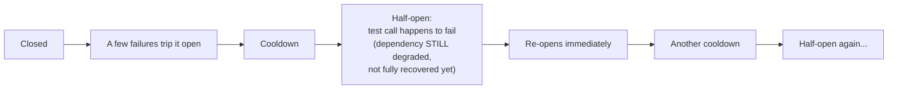

# Circuit Breaker — Senior

<!-- level-focus -->
At senior level, focus on this question:

> What causes a circuit breaker to "flap" (rapidly cycle open/closed), and
> how do you choose thresholds to prevent it?

Prerequisite: [`middle.md`](middle.md).

---

## The flapping scenario



If a dependency is **partially** degraded (succeeding sometimes, failing
other times, rather than cleanly up or down), a circuit breaker with an
aggressive threshold and a short cooldown can cycle through
open→half-open→open repeatedly, in a tight loop — never settling into a
stable state, and providing little real protection because it keeps
letting test traffic through during a still-unstable period.

## Threshold and cooldown design choices

| Parameter | Too aggressive | Too conservative |
|---|---|---|
| **Failure threshold** (how many/what ratio of failures trips it) | Trips on normal, brief error-rate noise — flaps constantly | Takes too long to trip on a genuine outage, allowing sustained load on a truly down dependency |
| **Cooldown duration** | Too short: repeatedly probes a still-recovering dependency, flapping | Too long: unnecessarily slow to resume traffic once the dependency has actually recovered |
| **Half-open test volume** | Too many test calls: risks re-overloading a barely-recovering dependency | Too few: slow, noisy signal about whether recovery is real |

## Using a rolling window and ratio, not a raw count

```python
class CircuitBreaker:
    def __init__(self, window_seconds=10, failure_ratio_threshold=0.5, min_calls=10):
        self.calls = SlidingWindow(window_seconds)

    def should_trip(self):
        total = self.calls.total()
        if total < self.min_calls:
            return False  # not enough data yet - avoid tripping on noise
        failures = self.calls.failures()
        return (failures / total) >= self.failure_ratio_threshold
```

Using a **ratio over a rolling window** (rather than "5 failures in a row")
smooths out noise from a brief, isolated blip while still reacting to a
genuine, sustained degradation — and requiring a minimum call volume before
evaluating the ratio prevents tripping based on a tiny, statistically
meaningless sample (e.g. "1 failure out of 2 calls" shouldn't trip a
breaker the same way "500 failures out of 1,000 calls" should).

> 🎯 **Senior takeaway:** flapping is almost always a symptom of thresholds
> tuned for a binary up/down mental model applied to a dependency that's
> actually partially degraded. A rolling-window failure ratio with a
> minimum sample size, combined with a cooldown long enough to give a
> recovering dependency real breathing room, is the standard fix — tune
> these against your dependency's actual observed failure patterns, not
> arbitrary defaults.

## Test yourself

1. Why does "5 failures in a row" as a trip condition flap more easily
   than "50% failure rate over the last 100 calls"?
2. Why is a minimum call-count requirement necessary before evaluating a
   failure ratio?
3. Design threshold and cooldown values for a dependency you know
   historically has brief 2-3 second blips fairly often, but rarely has
   outages longer than a minute.

Continue to [`professional.md`](professional.md) to design circuit breaker
state sharing across a fleet of service instances.
