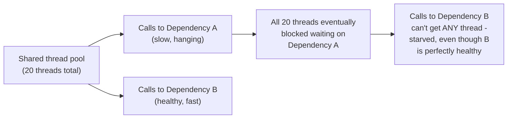
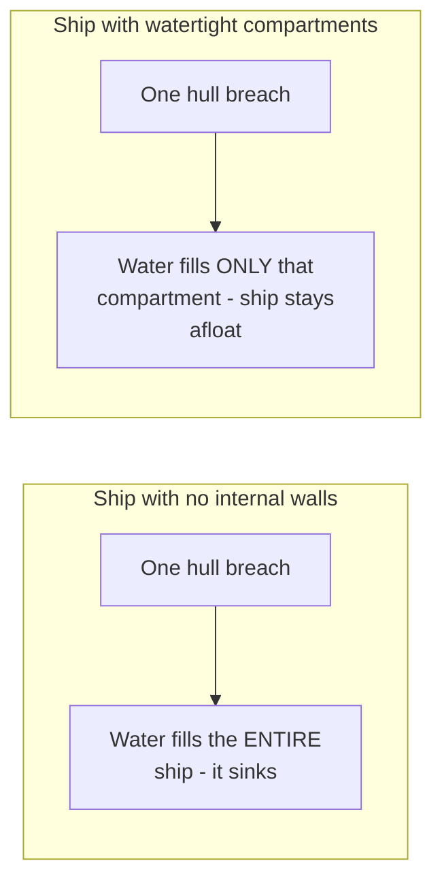

# Bulkhead — Junior

<!-- level-focus -->
At junior level, focus on this question:

> How can a slow, unrelated dependency starve calls to a completely
> healthy dependency, if they share the same resource pool?

---

## A shared thread pool with one slow dependency

If your application uses **one shared thread pool** for all outgoing
calls, and Dependency A becomes slow (each call takes 30 seconds instead of
100ms), threads calling A pile up waiting on it — eventually consuming
**every** thread in the shared pool. At that point, a request needing to
call the completely healthy Dependency B has **no thread available** to
even attempt that call — B's own health is irrelevant; the shared pool is
exhausted.

## The ship-compartment analogy

A **bulkhead** in software is the same idea: partition a shared resource
(thread pool, connection pool) into **separate, isolated** pools per
dependency (or per criticality tier), so that one dependency's problems
can only exhaust **its own** allocation, never spilling over to starve
calls to unrelated, healthy dependencies.

> 🎓 **Takeaway:** the danger isn't the slow dependency itself — it's that
> a **shared** resource pool lets one dependency's problem become
> everyone's problem. Bulkheading contains the damage to exactly the
> dependency that's actually struggling.

## Test yourself

1. Why does a slow (not failed) dependency cause more resource exhaustion
   than a dependency that fails instantly with an error?
2. In the shared-pool example, would a circuit breaker on Dependency A
   alone have prevented the thread-pool exhaustion, or is a separate fix
   needed?
3. Why is "watertight compartments" a good mental model for what a
   bulkhead does to a shared resource pool?

Continue to [`middle.md`](middle.md).
