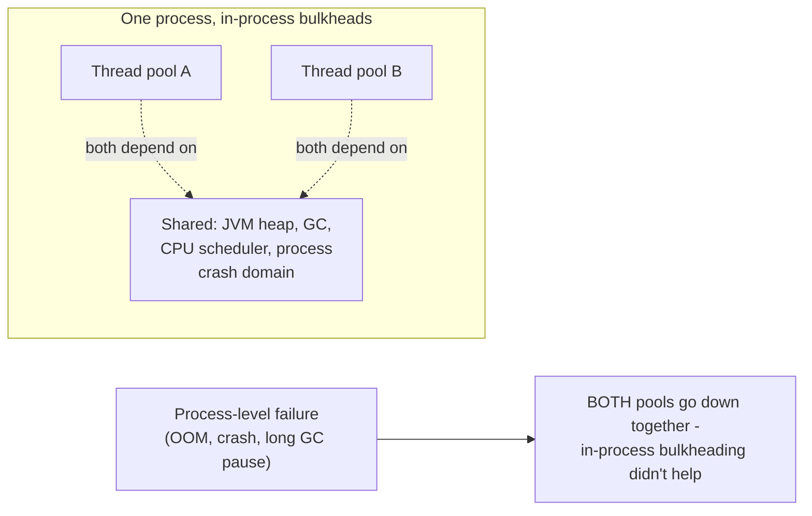
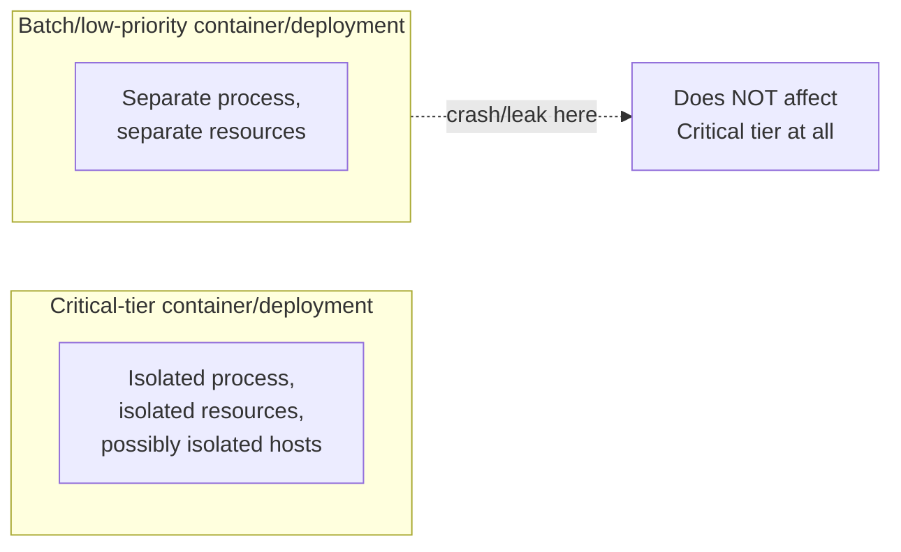

# Bulkhead — Professional

<!-- level-focus -->
At professional level, focus on this question:

> When does in-process pool partitioning stop being enough, and what does
> process- or container-level bulkheading look like in production?

Prerequisite: [`senior.md`](senior.md).

---

## The limit of in-process bulkheading: shared fate at the process level

`senior.md`'s thread/connection pool partitioning protects against
resource exhaustion **within** a process, but every partition still shares
the **same process's** memory, CPU scheduler, garbage collector, and — most
critically — the same **failure domain**: if a memory leak, an unbounded
queue growth, or a JVM/runtime-level pathology (a long GC pause, an
uncaught exception crashing the process) affects the process as a whole,
every bulkheaded partition inside it goes down together, regardless of how
well-isolated their thread pools were.



## Process/container-level bulkheading

Deploying different workload types (or different criticality tiers) as
**separate processes or containers** — potentially on separate hosts
entirely — extends bulkheading past the single-process limit: a memory
leak or crash in the container serving low-priority batch traffic cannot
take down the container serving critical, latency-sensitive traffic,
because they no longer share a process, a heap, or (with separate hosts) a
kernel or hardware failure domain at all.



This is the same principle behind Temporal's task-queue-per-workflow-type
isolation (from the Durable Execution professional page) and Database
Federation's blast-radius containment — bulkheading, at its most general,
is about deliberately choosing **failure domain boundaries** at whatever
granularity (thread pool, process, container, availability zone, region)
matches the actual blast radius you need to contain, and each granularity
level has a real cost (resource utilization, operational complexity,
infrastructure spend) that must be weighed against the specific failure
you're protecting against.

## Kubernetes resource limits as a bulkhead mechanism

In a containerized deployment, Kubernetes resource **requests and limits**
(CPU/memory) are themselves a bulkheading mechanism at the infrastructure
layer: a pod that leaks memory or spikes CPU is constrained by its own
limit and can be killed/throttled **without** consuming resources that
would otherwise be available to unrelated pods on the same node — this is
the platform-level analog of `middle.md`'s in-process thread pool
partitioning, applied to the container-orchestration layer instead of
application code.

## Production checklist (staff-level)

1. **Recognize when in-process bulkheading isn't sufficient** — if a
   failure mode you're worried about (memory leak, process crash, GC
   pathology) can take down the whole process regardless of internal pool
   partitioning, you need process- or container-level isolation instead.
2. **Deploy distinctly different criticality tiers as separate
   deployments/containers**, not just separate in-process pools, when the
   business cost of a low-priority workload affecting a high-priority one
   is significant.
3. **Set Kubernetes (or your orchestrator's) resource requests/limits
   deliberately as a bulkheading mechanism**, not just a scheduling hint —
   this is a real, infrastructure-level failure-domain boundary.
4. **Choose the bulkheading granularity (thread pool, process, container,
   AZ, region) based on the actual blast radius of the failure you're
   protecting against**, and be explicit about the cost (utilization,
   operational overhead) at each level, per `senior.md`'s trade-off
   extended to infrastructure scale.
5. **In a design review for a new multi-tenant or multi-workload-type
   service, require an explicit bulkheading strategy at every relevant
   layer** (in-process pools, deployment/container separation, and
   infrastructure-level limits) rather than assuming one layer's isolation
   covers all failure modes.

## Cheat Sheet

```text
+------------------------------------------------------------------+
|                    BULKHEAD — INTERNALS & SCALE                      |
+------------------------------------------------------------------+
| In-process bulkheads (separate thread/connection pools) protect        |
| against resource exhaustion WITHIN a process, but everything still     |
| shares the same process crash domain, heap, GC, and CPU scheduler -    |
| a process-level failure takes down ALL bulkheaded partitions together  |
+------------------------------------------------------------------+
| Process/container-level bulkheading: separate deployments for          |
| different criticality tiers/workload types - extends isolation past   |
| the single-process limit, at real infrastructure/operational cost      |
+------------------------------------------------------------------+
| Kubernetes resource requests/limits ARE a bulkheading mechanism at      |
| the orchestration layer - a leaking/spiking pod is constrained          |
| without starving unrelated pods on the same node                       |
+------------------------------------------------------------------+
| Choose bulkhead GRANULARITY based on the actual blast radius of the    |
| failure you're protecting against - thread pool, process, container,  |
| AZ, or region, each with its own cost/isolation trade-off              |
+------------------------------------------------------------------+
```

## Test yourself

1. Why does in-process thread pool bulkheading fail to protect against a
   memory leak in one code path affecting an unrelated code path in the
   same process?
2. Why are Kubernetes resource limits a real bulkheading mechanism, not
   just a scheduling convenience?
3. Design the bulkheading strategy (granularity choices at each layer) for
   a platform running both real-time user-facing traffic and long-running
   batch analytics jobs on the same infrastructure.

## Further Reading

- Michael Nygard — *Release It!* (the original, widely-cited treatment of
  the Bulkhead pattern in production systems).
- Kubernetes documentation — "Resource Management for Pods and
  Containers" (requests/limits as isolation mechanisms).
- resilience4j documentation — "Bulkhead" (semaphore-based vs.
  thread-pool-based implementations).
- See also: [Circuit Breaker — professional](../01-circuit-breaker/professional.md),
  [Durable Execution — professional](../../17-background-jobs/05-durable-execution-temporal/professional.md).
