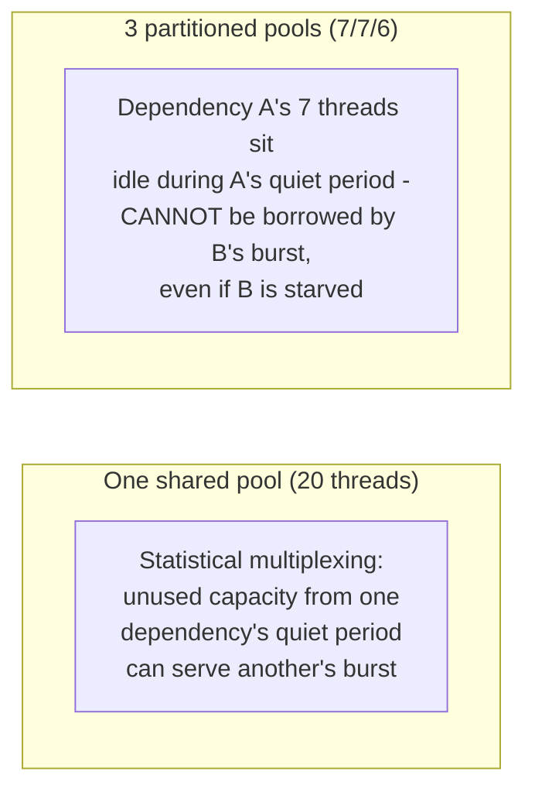
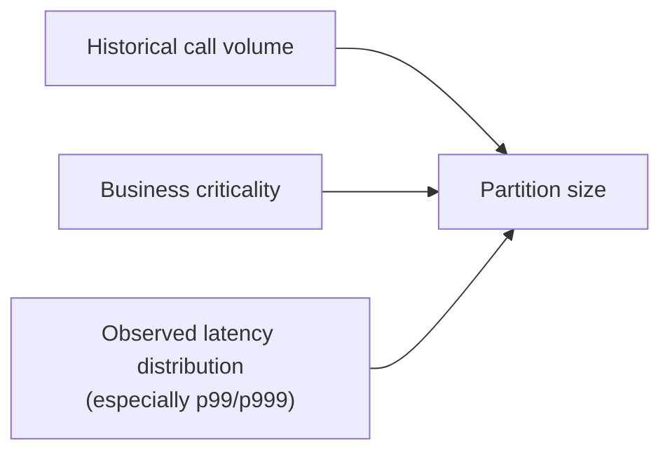

# Bulkhead — Senior

<!-- level-focus -->
At senior level, focus on this question:

> What's the actual cost of partitioning into many small pools, and how do
> you size each partition without over- or under-provisioning?

Prerequisite: [`middle.md`](middle.md).

---

## The utilization trade-off

A single shared pool benefits from **statistical multiplexing** — if
Dependency A is quiet right now, its "share" of capacity is effectively
available to whichever dependency currently needs it. Partitioning
sacrifices this: each partition's unused capacity sits idle and cannot be
borrowed by a different partition experiencing a burst, even momentarily.
This means naive, aggressive partitioning into many small pools can lead
to **lower overall utilization** — some pools idle while others are
saturated, wasting total capacity that a shared pool would have used more
efficiently.

## Sizing partitions based on actual traffic and criticality

| Sizing input | Why it matters |
|---|---|
| **Historical call volume per dependency** | A dependency called 10x more often than another shouldn't get an equal-sized partition. |
| **Criticality tier** | A payment-processing call may deserve guaranteed capacity even if its call volume is lower than a less-critical notification call. |
| **Observed latency distribution** | A dependency with occasional long-tail latency spikes needs more headroom in its partition than a consistently-fast one with the same average call volume. |

## A middle ground: semaphore-based bulkheads

Some resilience libraries (resilience4j's `Bulkhead`) offer a lighter-weight
alternative to full separate thread pools: a **semaphore** limiting
concurrent calls to a dependency **within a shared thread pool** — this
doesn't fully isolate resource *usage* the way separate thread pools do,
but it does prevent one dependency from consuming unbounded concurrent
calls, at a lower implementation/resource overhead than maintaining fully
separate pools for every dependency.

> 🎯 **Senior takeaway:** perfect isolation (many separate pools) and
> perfect efficiency (one shared pool) are two ends of a spectrum, not a
> free choice — partition based on actual measured traffic patterns and
> criticality, and consider a lighter-weight semaphore-based bulkhead when
> full pool separation's utilization cost isn't justified for a lower-
> priority dependency.

## Test yourself

1. Why can aggressive, uniform partitioning into many equal-sized pools
   actually waste more total capacity than a well-tuned shared pool?
2. Why might you deliberately give a lower-call-volume but
   business-critical dependency a larger partition than its raw traffic
   volume alone would suggest?
3. What's the practical difference between a full separate-thread-pool
   bulkhead and a semaphore-based bulkhead, in terms of what each actually
   isolates?

Continue to [`professional.md`](professional.md) to see stronger,
process/container-level bulkheading at scale.
