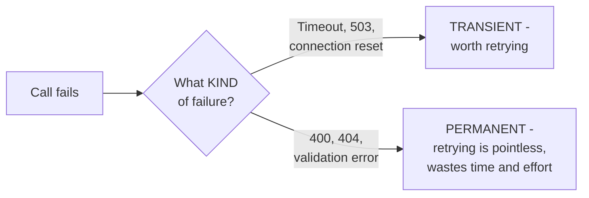

# Retry — Junior

<!-- level-focus -->
At junior level, focus on this question:

> Which failures are worth retrying, and which will just fail the exact
> same way every time?

---

## Transient vs. permanent faults

| Fault type | Example | Retry? |
|---|---|---|
| **Transient** | Network timeout, connection reset, HTTP 503 (Service Unavailable), a brief database failover | Yes — the condition causing it may have already resolved by the next attempt |
| **Permanent** | HTTP 400 (Bad Request), HTTP 404 (Not Found), a validation error, an authentication failure | No — retrying sends the exact same broken request and gets the exact same failure |

## Why retrying a permanent fault is actively harmful

Retrying a request that's malformed (a `400`) or targets a nonexistent
resource (a `404`) doesn't just waste effort — it delays the caller from
finding out about the real problem (their own bug) and, at volume, adds
pointless load identical to what a genuine transient-fault retry storm
would cause, for zero chance of ever succeeding.

> 🎓 **Takeaway:** the first, most important decision in any retry policy
> is classification — retry logic applied uniformly to every failure type
> is a bug waiting to manifest as wasted resources and delayed, confusing
> failures for genuinely broken requests.

## Test yourself

1. Why does retrying a `400 Bad Request` never help, no matter how many
   times you try?
2. Classify: a database connection timeout, an "insufficient funds" error
   from a payment API, a DNS resolution failure, an "invalid API key"
   error.
3. What real cost does blindly retrying every failure type add, beyond
   just "wasted time"?

Continue to [`middle.md`](middle.md).
