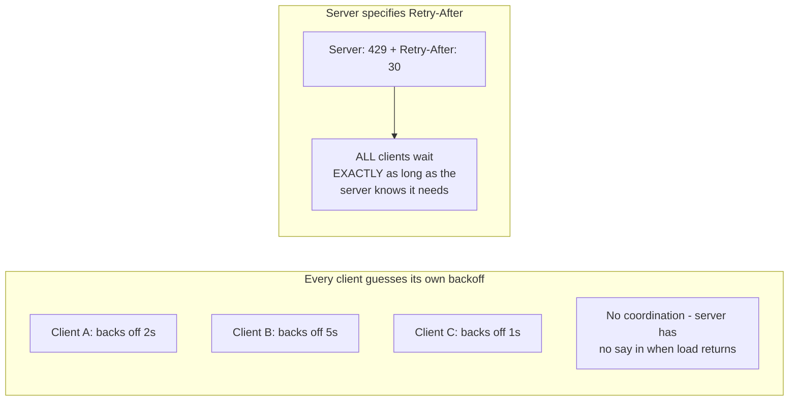

# Retry — Senior

<!-- level-focus -->
At senior level, focus on this question:

> Why is a server explicitly telling clients how long to wait
> (`Retry-After`) better than every client independently guessing a backoff
> schedule?

Prerequisite: [`middle.md`](middle.md).

---

## Client-guessed backoff vs. server-driven backoff



```http
HTTP/1.1 429 Too Many Requests
Retry-After: 30
```

When a server is overloaded or rate-limiting, **it** has the best
information about how long recovery will actually take (queue depth,
current load, a known rate-limit window reset time) — far better
information than any individual client guessing based on its own local
backoff schedule. A `Retry-After` header (standard HTTP, RFC 9110) lets the
server communicate this directly, and well-behaved clients should honor it
over their own computed backoff.

## Why this matters at scale

If every client uses its own jittered exponential backoff (per the
Retries & Idempotency middle-level mechanics) without honoring
`Retry-After`, the server has no way to signal "actually, I need
**exactly** 30 more seconds, not whatever your local schedule computes" —
clients might retry too early (still overloading a server mid-recovery) or
unnecessarily late (leaving capacity idle that the server has already
recovered). Server-driven backoff closes this information gap.

> 🎯 **Senior takeaway:** client-side exponential backoff with jitter is
> the right default when the server gives no explicit guidance. But
> whenever a server **can** communicate its own recovery timeline
> explicitly (`Retry-After`, a rate-limit reset timestamp), clients should
> prefer that authoritative signal over their own local guess — this is a
> genuine additional layer of coordination beyond what pure client-side
> backoff can achieve alone.

## Test yourself

1. Why does the server generally have better information than the client
   about how long to wait before retrying?
2. What should a client do if a server returns `Retry-After: 300` (5
   minutes) — should it honor that exactly, cap it, or ignore it if it
   seems too long?
3. Design retry logic that prefers `Retry-After` when present, falling
   back to exponential backoff with jitter when it's absent.

Continue to [`professional.md`](professional.md) to standardize retry
policy across an organization's services.
